<!-- Please do not change this logo with link -->

<a target="_blank" href="https://www.microchip.com/" id="top-of-page">
   <picture>
      <source media="(prefers-color-scheme: light)" srcset="images/mchp_logo_light.png" width="350">
      <source media="(prefers-color-scheme: dark)" srcset="images/mchp_logo_dark.png" width="350">
      
   </picture>
</a>

# Interface Ambient Light Sensor using the PIC32CM6408PL10048 Curiosity Nano Board and Curiosity Nano Explorer

These code examples are intended to reinforce usage of the Arm® Cortex® in PIC32CM PL10 MCU low-power modes. These exercises are a guide in configuring peripherals for low power, understanding the code generated with MPLAB® Code Configurator (MCC), and using it in an application.

These examples provide specific instructions to reduce system power consumption using sleep modes, performance levels, clock domains, the Event system, and sleepwalking peripherals. Upon completion, readers are encouraged to use additional resources to deepen knowledge and understanding.

**<u>Upon completion, the following objectives will have been achieved:</u>**
- Have hands-on experience configuring and using system components and peripherals for low-power operations
- Have hands-on experience using the MPLAB Tools for VS Code Extension
- Have hands-on experience using MPLAB Harmony code generated within an application
- Be able to measure and visualize power consumption using Data Visualizer

## Related Documentation

- [PIC32CM PL10 Curiosity Nano EV10P22A](https://www.microchip.com/en-us/development-tool/ev10p22a)
- [Curiosity Nano Explorer board EV58G97A](https://www.microchip.com/en-us/development-tool/EV58G97A?_ga=2.255984587.1527562019.1718650260-1302344245.1675103399)
- [MPLAB® XC32 C/C++ Compiler User's Guide for PIC32C/SAM MCUs](https://ww1.microchip.com/downloads/aemDocuments/documents/DEV/ProductDocuments/UserGuides/MPLAB-XC32-CC-Compiler-UG-for-PIC32CSAM-MCUs-DS50002895.pdf)
- [MPLAB® Harmony v3](https://www.microchip.com/en-us/tools-resources/configure/mplab-harmony)

## Software Used

- Visual Studio Code® v1.108.2 or newer
- MPLAB® Tools for VS Code® v1.2.2 or newer [(MPLAB® Tools for VS Code® 1.2.2)](https://www.microchip.com/en-us/tools-resources/develop/mplab-tools-vs-code)
- MPLAB® XC32 5.0.0 or newer compiler [(MPLAB® XC32 5.0.0)](https://www.microchip.com/en-us/tools-resources/develop/mplab-xc-compilers/xc32)

## Hardware Used

- [Curiosity Nano Explorer board EV58G97A](https://www.microchip.com/en-us/development-tool/EV58G97A?_ga=2.255984587.1527562019.1718650260-1302344245.1675103399)
  - [User guide](https://ww1.microchip.com/downloads/aemDocuments/documents/MCU08/ProductDocuments/UserGuides/CNANO-Explorer-UserGuide-DS50003716.pdf)
  - [Schematics](https://ww1.microchip.com/downloads/aemDocuments/documents/MCU08/ProductDocuments/BoardDesignFiles/Curiosity-Nano-Explorer-Schematics.pdf
  )

- [PIC32CM6408PL10048 Curiosity Nano](https://www.microchip.com/en-us/development-tool/ev01e86a)
  - [PIC32CM6408PL10048 Curiosity Nano User Guide](https://ww1.microchip.com/downloads/aemDocuments/documents/MCU08/ProductDocuments/UserGuides/PIC18F56Q24-CNANO-UserGuide-DS50003618.pdf)
  - [Schematics](https://ww1.microchip.com/downloads/aemDocuments/documents/MCU08/ProductDocuments/BoardDesignFiles/PIC18F56Q24-Curiosity-Nano-Schematics.PDF)

- [PIC32CM6408PL10048 product page](https://www.microchip.com/en-us/product/pic18f56q24)

## Opening projects in VS Code
**NOTE:** Open VS Code, then use **File → Open Folder...** and select the lab folder (for example, PL10_LowPower_LAB1). The folder appears in the Explorer and becomes the workspace.

## Labs

- Lab 1: Open Default MPLAB® Code Configurator and Measure the Baseline Current
- Lab 2: Active Mode Light Sensor Project and Average Current Measurements
- Lab 3: Standby Mode Light Sensor Project and Average Current Measurements
- Lab 4: Sleepwalking Light Sensor Project and Average Current Measurements

# Lab 1
### Purpose
After completing Lab 1, the following will be understood:

- How to use the Curiosity Nano Explorer board to measure the current and power consumption of the PIC32CM PL10 MCU in Standby mode
- How to use MPLAB® Data Visualizer to view and analyze the Standby mode currents of the PIC32CM PL10 MCU

### Overview
This lab uses the PL10_LowPower_LAB1 MPLAB Harmony v3 project, configured with MPLAB Code Configurator (MCC), to demonstrate how to measure the baseline current of the PIC32CM PL10 MCU in Standby mode. The project is set up so that the MCU enters Standby mode immediately after startup, allowing measurement of its low-power consumption with no additional application functionality running.

Once the device is in Standby mode, the Curiosity Nano Explorer's current measurement features can be used to observe and record the MCU's power usage. This establishes a reference for future labs.

This baseline capture is intentionally simple: it isolates regulator behavior, clock tree settings, and standby leakage to enable comparison of later labs against a known low-power floor. When reviewing the time plot, expect a steady, low-current trace with minimal activity, since no peripherals are actively sampling or transmitting.


#### Figure 1: Block diagram

The project demonstrates the use of the `PM_StandbyModeEnter()` function to place the MCU in Standby mode.

### Hardware Setup
- Use the Curiosity Nano Explorer board to measure the current drawn by the PIC32CM PL10 CNano (MCU) using the onboard PAC1944 power monitor
- The PAC1944 has four measurement channels:
  - CH1 (µA range, 51Ω sense resistor) and CH4 (mA range, 0.22Ω sense resistor) measure the CNANO P3V3 power domain
  - CH2 measures the P3V3 domain (not used for CNano current)
  - CH3 measures the P5V0 domain (not used for CNano current)
- For accurate low-power measurements of the PL10 CNano:
  - Use CH1 for microamp (µA) measurements (for currents below 2 mA)
  - Use CH4 for milliamp (mA) measurements (for currents above 2 mA)
### NOTE: Ensure the board is not powered by USB when setting up the jumpers and measurement configuration.

- To select the measurement channel:
  - Place the jumper on header J506 for CH4 (mA) measurements (CH1 bypassed)
  - Remove the jumper from J506 for CH1 (µA) measurements (CH1 connected)
  - Only one channel should be active at a time to avoid voltage drop issues
  - See section *4. Power Supply and Monitor* of the [Curiosity Nano Explorer User Guide](https://ww1.microchip.com/downloads/aemDocuments/documents/MCU08/ProductDocuments/UserGuides/CNANO-Explorer-UserGuide-DS50003716.pdf#page=13)
  - For all labs, the current draw of the PIC32CM PL10 CNano is monitored on Channel 1
  - Remove the J506 Header and leave the 2 headers for J504

    

    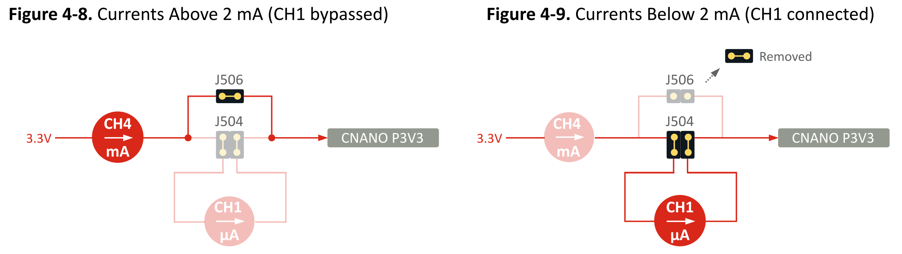

- Set the I²C slide switch to the "MCP2221A" position to connect the PAC1944 to the I²C bus for current measurement

    

- After all setup is complete, connect the Curiosity Nano Explorer to the host PC via USB to measure the PIC32CM PL10 CNano current draw

### Lab 1 Structure
- Part 1: Open the Project and Review Power Module Configurations
- Part 2: Examine the Low-Power Code and Build the Application
- Part 3: Use MPLAB® Data Visualizer to Observe and Record Current Measurements

## Part 1: Open the Project and Review Power Module Configurations
**NOTE:** Open VS Code and ensure that the MPLAB Tools for VS Code extension is properly installed and up to date.

  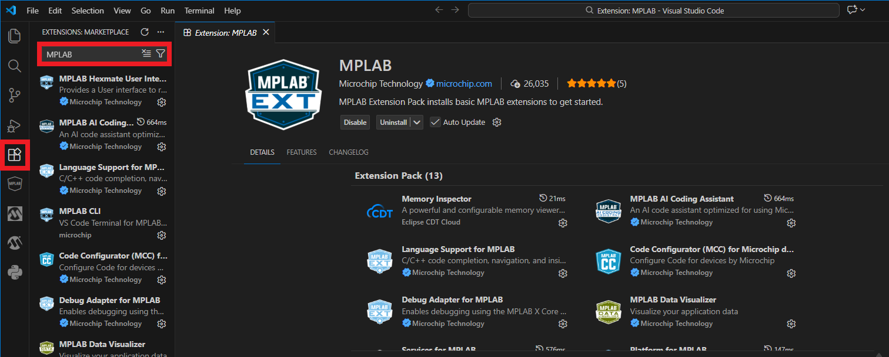

1.1 Click the Explorer tab to view available options.

1.2 Click **Open Folder** in the Explorer tab to find the PL10_LowPower_LAB1 project.

1.3 Select the PL10_LowPower_LAB1 folder.

1.4 Click "Select Folder" to open the PL10_LowPower_LAB1 project.

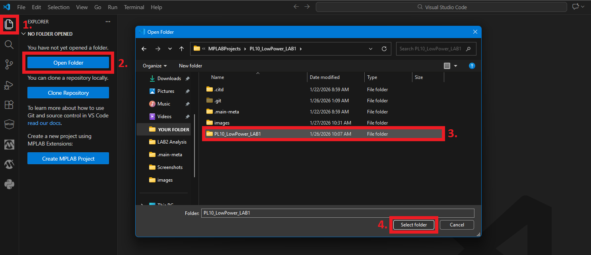

- The folder appears in the VS Code Explorer tab. This becomes the workspace and contains all `src` and `mcc` files inside `My_MCC_Config`
- Review the power configuration settings in MCC to confirm the device is set up for Standby mode operation

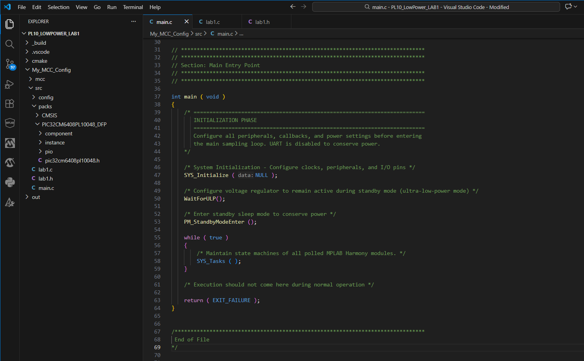

1.5 Use `Ctrl` + `Shift` + `P` on Windows to open the Command Palette. Alternatively, use `View > Command Palette` from the application menu.

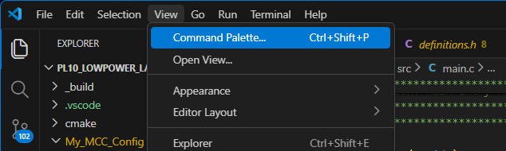

- In the Command Palette, type `MPLAB MCC` to launch the Microchip Code Configurator (MCC)

  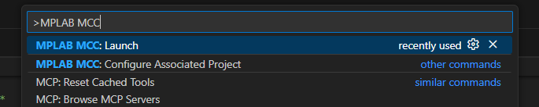

  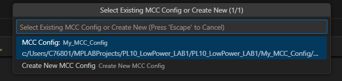

1.6 The LAB1 Project Graph appears as shown below. Click each block to review the default configurations.

  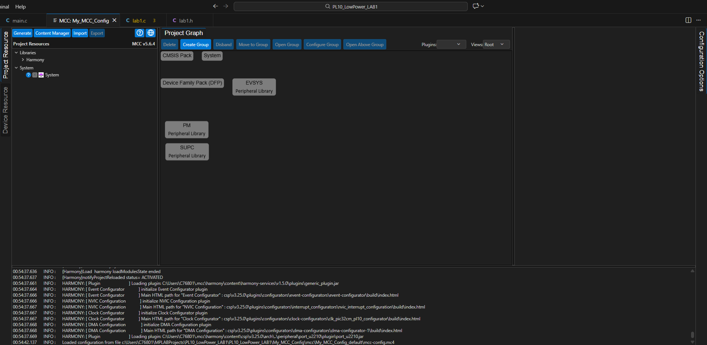

## Part 2: Examine the Low-Power Code and Build the Application
2.1 Open `main.c` in the `src` directory.

2.2 Before entering Standby mode, ensure the ULPVREF is ready by calling `WaitForULP();` (see `lab1.c` for implementation).

2.3 Once ULPVREF is ready, enter Standby mode by calling `PM_StandbyModeEnter();`.

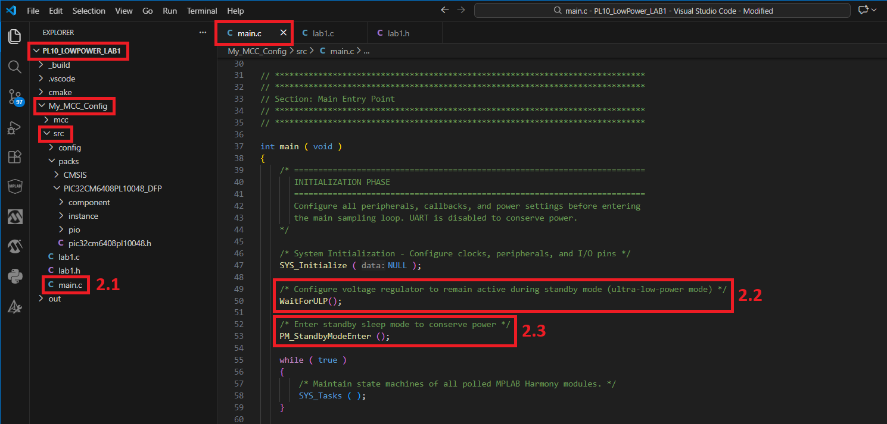

**NOTE:** The `WaitForULP()` function ensures the SUPC->STATUS.ULPVREFRDY bit is set before entering Standby mode.

```c
WaitForULP();
PM_StandbyModeEnter();
```

2.4 Build the application and program the board using the MPLAB Tools for VS Code extension.
- Insert the PIC32CM PL10 Curiosity Nano into the CNano Adapter in the center of the Curiosity Nano Explorer board. Ensure the PIC32CM PL10 Curiosity Nano is oriented properly with the USB-C port facing the top side of the Curiosity Nano Explorer board.
- Connect the PIC32CM PL10 Curiosity Nano to the PC via USB cable. Connect the Curiosity Nano Explorer board to the PC via USB cable.

  
- Use the Command Palette within VS Code to build the project
  - Use `ctrl` + `shift` + `P` on Windows to quickly access the Command Palette. Another way to access the Command Palette is to navigate to `View > Command Palette` from the application menu.

    

  - Type in the Command Palette `MPLAB Clean Build` to see the command to clean and build the project

    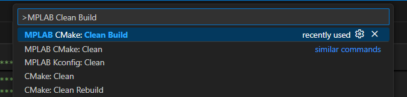

  - Once the project finishes the clean and build, use the Command Palette again and now enter `MPLAB Program Device`

    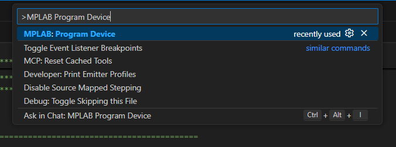

  - Now select the `default.hex` file to program. This hex file is generated when performing the clean and build and is found in the `out` folder inside the Explorer tab.

    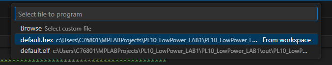

  - Select the PIC32CM PL10 CNano connected to the computer as the debug tool

    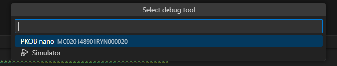

    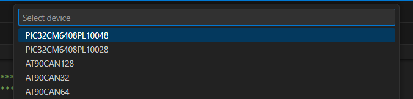

### Part 3: Use MPLAB Data Visualizer to Observe and Record Current Measurements
- Open MPLAB Data Visualizer using the Command Palette

  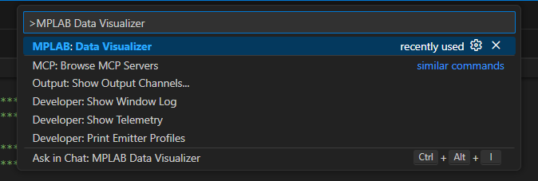
- When both the Curiosity Nano Explorer Board and the PIC32CM PL10 CNano are connected, the Data Visualizer will show all of the available data sources
- Under `Connections > CNano Explorer`, toggle the slider to connect to the device
- Once connected, click the graph icon to display raw data on the time plot. This will enable all the Power Monitor channels and they can be seen in the Data Axis panel.
- Remove channels not required for monitoring (Voltage and/or Power). For this example, only the current draw of the PIC32CM PL10 CNano on Channel 1 will be monitored.

  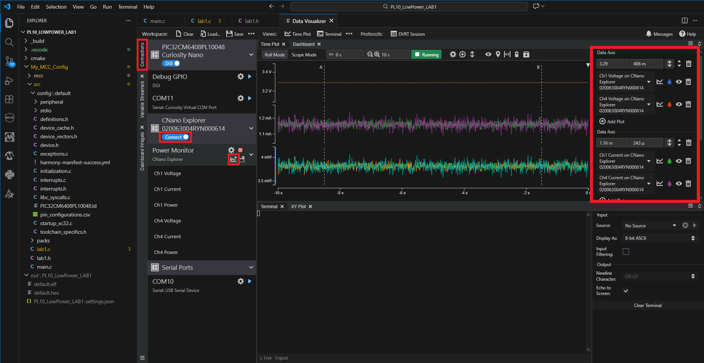
- Set the time range to 10 s for a clear view of the current waveform

  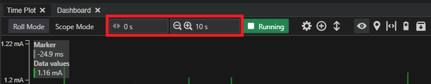

**NOTE:** Use the Stopped and Running mode buttons to control the time plot as needed.

  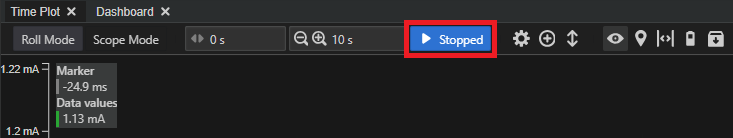

  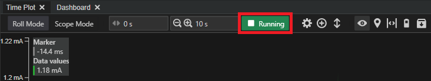

- To measure average current:
  1. Click the Toggle Inspect Values icon to inspect values. This shows the time and data values of cursors A and B.
  2. Click the Freeze and Place Cursor icon to freeze the plot and place cursors A and B.
  3. Click the Power Analysis icon to display average current and other values.

      

  - Review the average current in the Power Analysis table (3) in the Data Visualizer. For the following labs, view both the Ch1 and Ch4 currents.

    

- In the Lab 1 baseline capture, the trace should look steady with minimal activity. Example plot shows Ch1 averaging about 1.16 mA (min about 1.10 mA, max about 1.23 mA) and Ch4 averaging about 1.15 mA (min about 1.08 mA, max about 1.27 mA). Use this as the reference point for comparing the added bursts and higher averages in Labs 2-4.

# Lab 2
### Purpose
After completing Lab 2, the following will be understood:

- How to use the Curiosity Nano Explorer board and the AMBIENT Click Board (MIKROE-1890) to measure and process ambient light in active mode
- How to configure and use the PIC32CM PL10 MCU peripherals using MCC inside VS Code to periodically sample the light sensor and transmit data to the terminal when a threshold is exceeded
- How frequency scaling and peripheral configuration can reduce power consumption in active mode
- How to use MPLAB® Data Visualizer to view and analyze the active mode currents of the PIC32CM PL10 MCU

### Overview
This lab uses the PL10_LowPower_LAB2 MPLAB Harmony v3 project, configured with MPLAB Code Configurator (MCC), to demonstrate periodic sampling of the AMBIENT Click Board (MIKROE-1890) using the ADC. The application averages 16 ADC samples every 100 ms. If the average exceeds a threshold, the last 20 averaged readings are printed to the terminal with the message "BRIGHT".

The project demonstrates the use of the RTC, TC, ADC, SERCOM, SUPC, and PM peripherals for low-power, periodic sensor measurement and data reporting.

Compared to Lab 1, this lab adds an active sampling and UART reporting workload. In the time plot expect to see repetitive current pulses from powering the sensor and running the ADC, with occasional UART bursts when the brightness threshold is exceeded. The optional CPU clock scaling step highlights how reducing core frequency during idle periods can lower the average without changing the sampling rate.


#### Figure 2: Block diagram

## Hardware Setup
- Configure the Curiosity Nano Explorer board to measure the MCU currents as in Lab 1
  - Make sure the board is not powered by USB. (Remove the USB cable)
  - For this lab, make sure the J506 Header is removed and leave the 2 headers for J504

  

  - After setup, connect the PIC32CM PL10 Curiosity Nano and the Curiosity Nano Explorer board to the computer via the USB cables
## Lab 2 Structure

- Part 1: Adding and Configuring Peripherals for Active Mode Light Sensor Project to Lab 1 (RTC, TC, ADC, SERCOM, SUPC, clock, and pins)
- Part 2: Add Application Code and Build
- Part 3: Use the MPLAB Data Visualizer to Observe Current Measurements and Tabulate the Results

## Part 1: Add and Configure Peripherals for Active Mode Light Sensor Project

- Develop Lab 2 by extending Lab 1, using the AMBIENT Click Board (MIKROE-1890) on a breadboard, powered by a GPIO pin from the PIC32CM PL10 Curiosity Nano
- Open the Lab 2 project in VS Code and launch MPLAB Harmony Code Configurator (MCC) as described in Part 1 of Lab 1
- Close the MPLAB Data Visualizer before launching MCC

- Add the following peripheral modules in MCC:
  - In the Device Resource window, navigate to `Libraries > Harmony > Peripherals > RTC`
  - Double-click `RTC` to add the RTC peripheral library (PLIB) to the Project Graph
  - Similarly add `TC1`, `ADC0`, `SERCOM1`, `SUPC`, and `PM` to the Project Graph

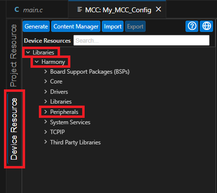
- The Project Graph should look like this after adding the peripherals

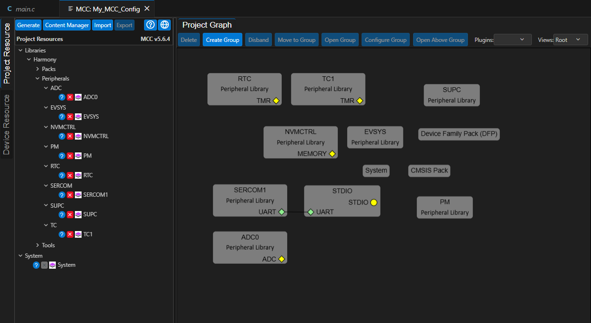

- Launch Clock Configuration:
  - Open the `Clock Configurator` from the Plugins dropdown menu. The Clock Easy View window will open.

    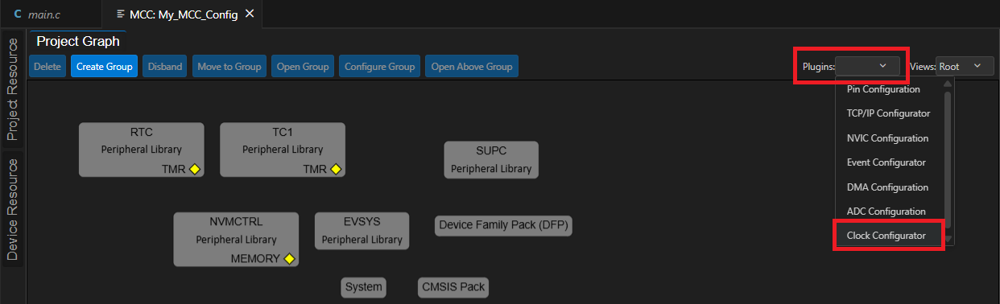

  - Internal OSCHF (24 MHz) is the main oscillator. Set GCLK0 to use OSCHF divided by 3 for an 8 MHz CPU clock.
  - GCLK0 (8 MHz) is used for the CPU and SERCOM1 (UART)

  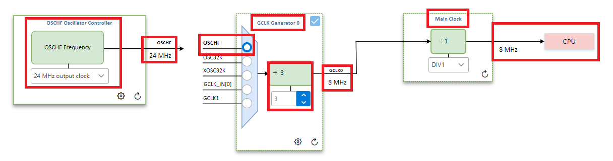

  - GCLK1 uses OSC32K (32.768 kHz) with divider 1 for a 32.768 kHz clock. This is used for TC1.

  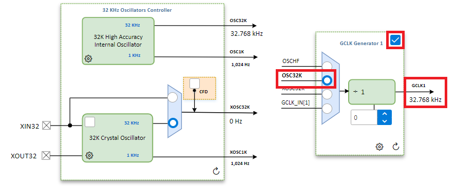

  - In Peripheral Clock Configuration, assign GCLK0 (8 MHz) to SERCOM1. Assign GCLK1 (32.768 kHz) to TC1.

  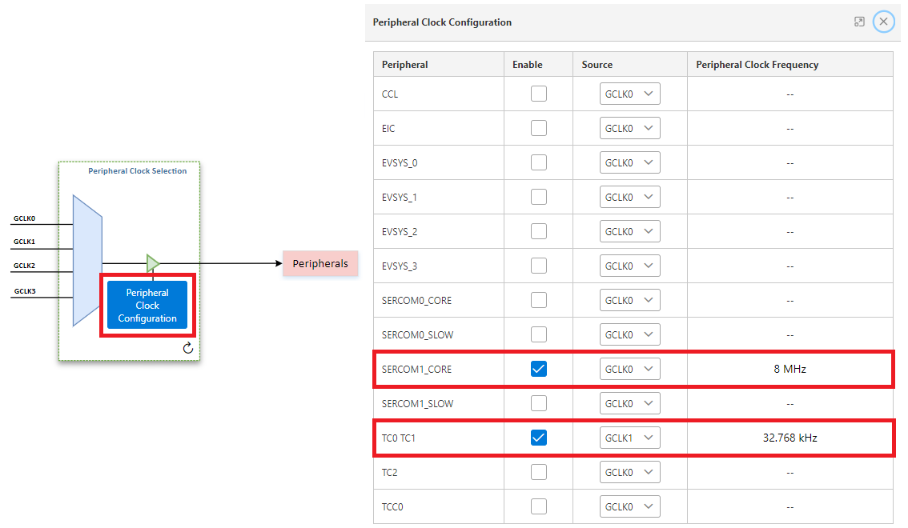

  - Close the Clock Easy View window and proceed

**NOTE:** Clock settings for Lab 2 and Lab 3 are the same. Ensure all peripheral clock sources are set as shown in the previous images.

- Configure the RTC module:
  - Click on the RTC module. The Configuration Options window will appear on the right.
  - Set RTC operation mode to 32-bit Counter Mode
  - Enable the Compare 0 Interrupt
  - Set the Compare Value to 0x66 for (~100 ms timeout)
  - Enable Clear on Compare Match

    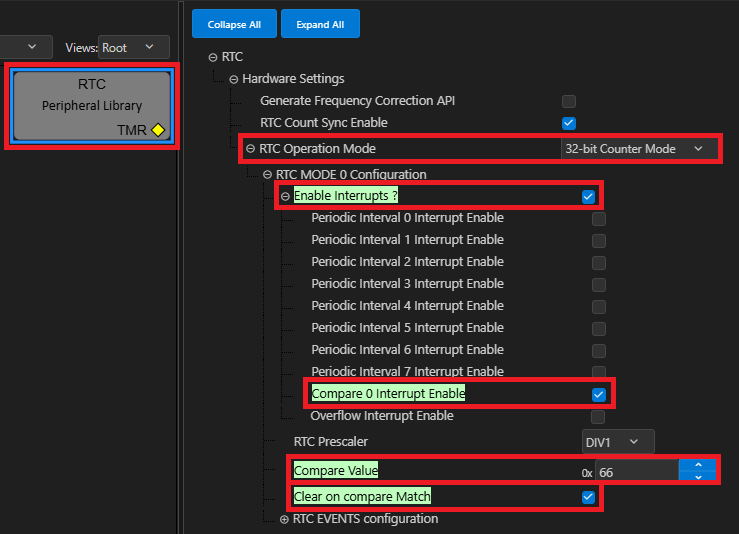

Optional Info: The RTC is configured to operate in counter mode and triggers an interrupt every ~100 ms when the compare value is matched. The clock source is OSC32K (32.768 kHz) divided by 32, so each count is approximately 0.977 ms. Setting compare value to 0x66 (102 decimal) gives ~100 ms period.

- Configure the TC1 module:
  - Click on the TC1 module. The Configuration Options window will appear on the right.
  - Enable One-Shot Mode
  - Set the Time to 10 ms
  - Timer Period Interrupt is enabled by default

    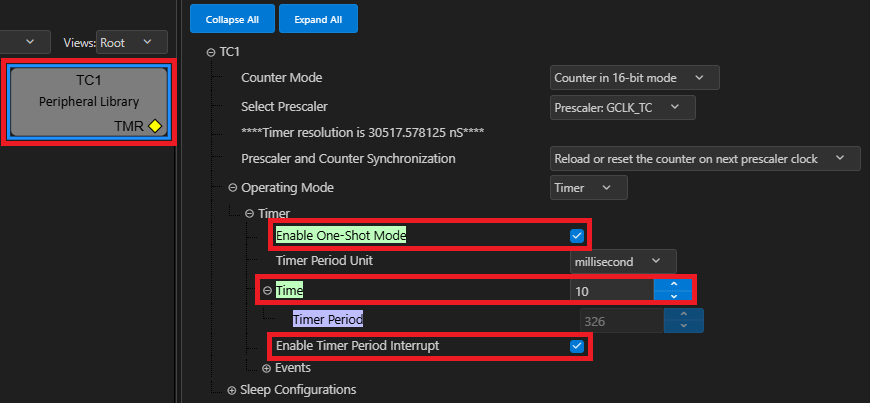

Optional Info: One-shot mode means the timer runs once per trigger. The light sensor is powered ON for 10 ms, then stopped. Timer period interrupt is triggered every 10 ms when TC1 times out.

- Configure the ADC0 module:
  - Click on the ADC0 module. The Configuration Options window will appear on the right.
  - Set voltage reference to AVDD
  - Set Conversion Trigger to SW Trigger
  - Under Result Configuration, enable Result Ready Interrupt
  - Set the ADC AIN26 pin (PA26) in the pin settings using the pin configuration plug-in

    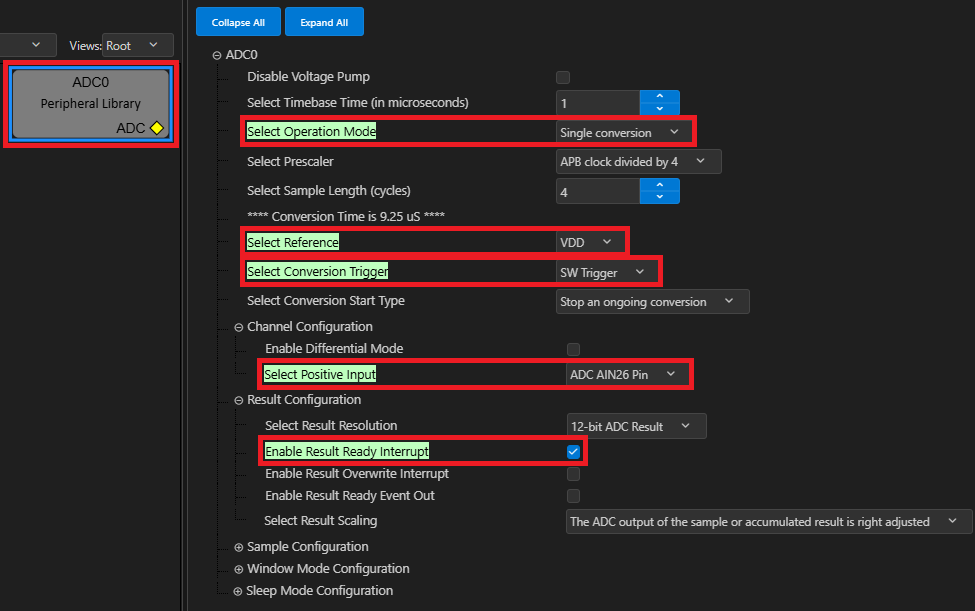

Optional Info: ADC input range is 0V to AVDD. Conversion is triggered by calling ADC_ConversionStart(). Result ready interrupt is triggered for each conversion. The application collects 16 ADC samples per measurement cycle and averages them to reduce noise. The averaged results are stored in a circular buffer of 20 entries for later transmission.

- Configure the SERCOM1 module:
  - Right-click the yellow UART option button and select STDIO (stdio) as the consumer

    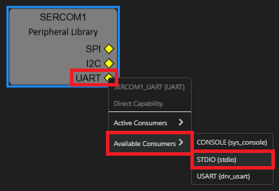
  - Click on the SERCOM1 module. The Configuration Options window will appear on the right.
  - Set Baud Rate to 230400 Hz

    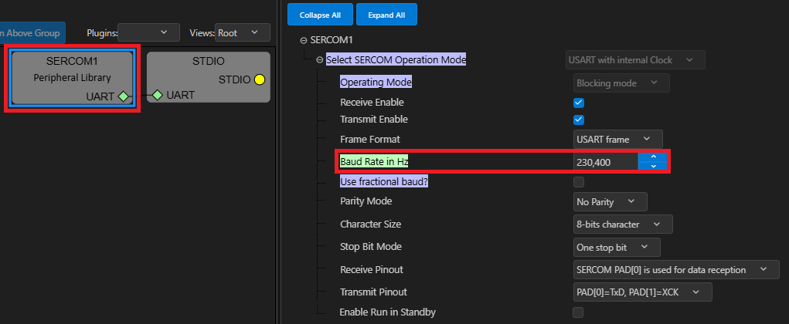

NOTE: Set the TX and RX pins in the pin settings using the pin configuration plug-in. These settings will be explained in the next steps.

Optional Info: Connecting UART to STDIO enables use of printf() to print messages to the console (e.g., Tera Term). Maintain the same baud rate in the serial console.

- Configure the SUPC Block:
  - By default, Standby mode operation automatically switches from the LDO to the ULP regulator when running on the 32.768 kHz oscillator

    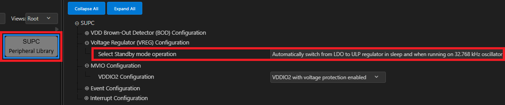

- Configure the PM Block:
  - There is nothing to reconfigure within this peripheral

    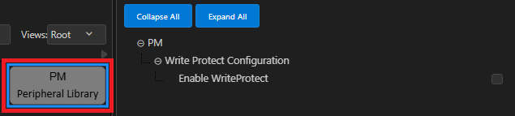

- Configure the pins:
  - Open Pin Configuration from the Plugins drop-down menu and go to the Pin Settings window
  - Set PA22 as GPIO OUT, powering the light sensor (LightSensorVdd)
  - Set PA26 as ADC0 AIN26 (sensor analog input)
  - Set PB00 as SERCOM1 PAD0 (TX, UART transmit)
  - Set PB01 as SERCOM1 PAD1 (RX, UART receive, typically unused)
    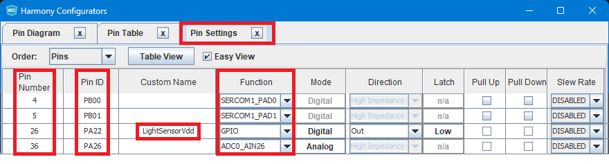

NOTE: All pin assignments can be verified by selecting the Pin Diagram tab. Assigned pins are green; available pins are blue.

**AMBIENT Click Board Note:**
  - The LightSensorVdd pin (PA22) is controlled in software using macros to turn the sensor ON and OFF for each measurement cycle, further reducing power consumption
    - Use a jumper wire to connect the LightSensorVdd pin PA22 to the AMBIENT Click Board 3.3V Input pin
    - Use a second wire to ground the AMBIENT Click Board to the Curiosity Nano Explorer
    - Finally, use a jumper wire to connect the AN pin on the AMBIENT Click Board to the ADC Input of the PIC32CM PL10 CNano

- Configure the main2.c file:
  - Select the System block
  - Navigate to Device & Project Configuration > Project Configuration > Generate Main Source File
  - Change Main File Name to main2

    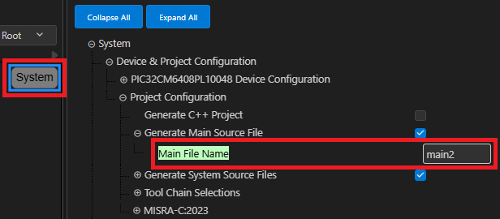

## Part 2 Lab 2
- Generate the code based on the peripheral configuration
  - Once all the above settings are made, it is time to generate the code. Click the Generate button on the MCC tab (Project Resource).

    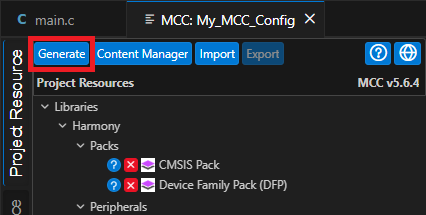
  - The Output tab shows the status of the MPLAB Harmony code generation

    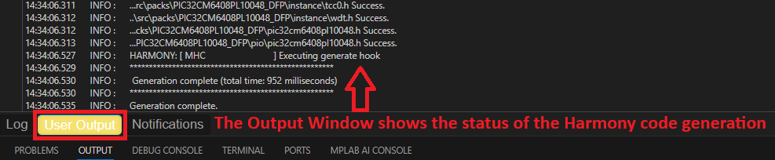
- Add the lab2.c and lab2.h files
  - Remove the lab1.c and lab1.h files
  - Download the Lab 2 source files
  - Add the lab2.c and lab2.h files to the workspace under `My_MCC_Config > src` by dragging and dropping the files in VS Code or File Explorer
  - Remove the main.c file by right-clicking the file and navigating to Delete

      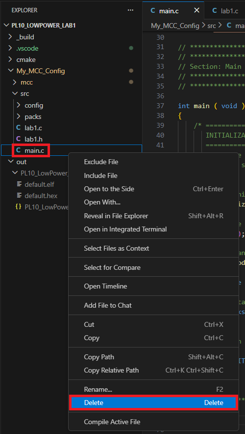
  - Go to the main2.c file, rename the file to `main.c`, and include `lab2.h` after the `#include "definitions.h"` line.

- Include this after `#include "definitions.h"`:

    - ```#include "lab2.h"```

    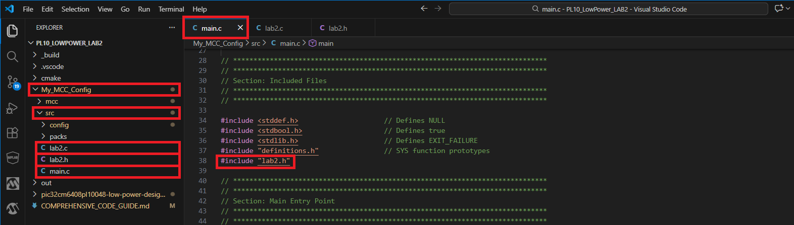

- Add the Initialization Application Code to `main.c`
  Copy the APIs below directly to `main.c` file after `SYS_Initialize ( NULL )`.

    ```
    /* 1. Pin Configuration - Light sensor starts powered off */
    LightSensorVdd_Clear();

    /* 2. Register interrupt callbacks for RTC (100ms timer), TC1 (10ms warm-up), and ADC (result ready) */
    RegisterCallbacks();

    /* 3. Enable ADC peripheral for light sensor measurements */
    ADC0_Enable();

    /* 4. Start RTC Timer and enable 100ms compare interrupt for sampling intervals */
    RTC_Timer32Start();
    RTC_Timer32InterruptEnable(RTC_TIMER32_INT_MASK_CMP0);

    /* 5. Disable UART initially to save power - will be enabled only when transmitting data */
    SERCOM1_USART_Disable();
    ```

  - **Step 1:** The application first configures the LightSensorVdd pin to be set low (PA22), ensuring the light sensor starts powered off. This prevents any current spike when the application first starts.
  - **Step 2:** Register interrupt callbacks for the RTC timer (100ms intervals), TC1 timer (10ms sensor warm-up), and ADC (result ready notification)
  - **Step 3:** Enable the ADC peripheral for light sensor measurements
  - **Step 4:** Start the RTC Timer and enable the 100ms compare interrupt (CMP0) for periodic sampling intervals
  - **Step 5:** Disable the UART initially to save power. The UART will only be enabled when transmitting data above the threshold.

    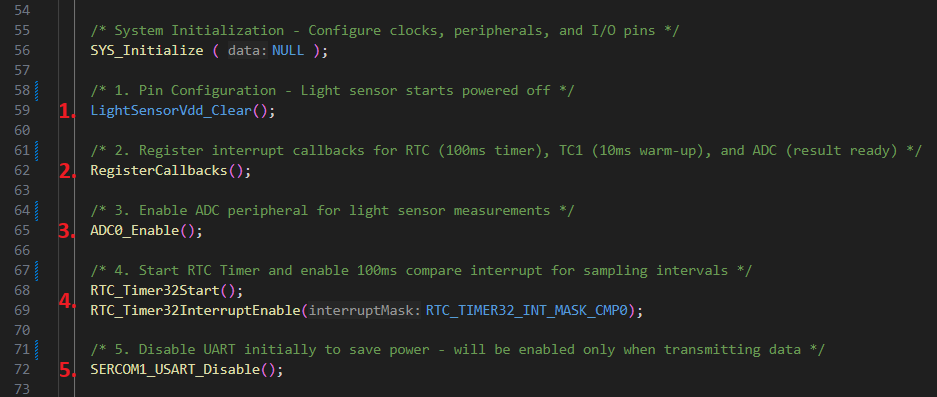

  - Add the main task application code to the `main.c`

 **Power Management Note:**
  - The application can optionally reduce the CPU frequency to 2.048 kHz (OSC32K/16 via GCLK0) during idle periods, then restore it to 8 MHz (OSCHF/3) for active processing

Copy the APIs below inside while(1) after SYS_Tasks( ).

        /* === STEP 1: Wait for RTC 100ms compare interrupt === */
        WAIT_FOR_100mS_RTC_TIMEOUT();   /* Wait for RTC interrupt, then clear flag */

        /* === OPTIONAL: Restore CPU to full speed for active sampling === */
        /* Uncomment to enable dynamic clock speed management for power savings */
        // SetCPUSpeedToNormal();

        /* === STEP 2: Power up light sensor and wait 10ms for stabilization === */
        LightSensorVdd_Set();           /* Apply power to sensor */
        TC1_10mS_TIMER_START();         /* Wait 10ms for sensor warm-up */

        /* === STEP 3: Collect 16 ADC samples and power down sensor === */
        StartADCDataCollection();       /* Sample ADC 16 times from AIN26 */
        LightSensorVdd_Clear();         /* Remove power from sensor */

        /* === STEP 4: Process data and conditionally transmit === */
        AverageLightSensorData();               /* Calculate mean of 16 samples */
        TransmitLightSensorDataToTerminal();    /* If > 2000, send "Bright!" + 20 values */
        StoreLightSensorDataToBuffer();         /* Advance circular buffer index */

        /* === OPTIONAL: Reduce CPU speed during idle period === */
        /* Uncomment to enable dynamic clock speed management for power savings */
        // ReduceCPUSpeed();

- **Step 1:** Wait for the RTC 100ms compare interrupt by calling `WAIT_FOR_100mS_RTC_TIMEOUT()`. This blocks until the RTC fires, then atomically clears the interrupt flag.

- **Optional (commented out by default):** Restore CPU to full speed (8 MHz) for active sampling by calling `SetCPUSpeedToNormal()`. Uncomment to enable dynamic clock speed management for additional power savings. This section and the second section at the end of the `while` loop must be uncommented.

- **Step 2:** Power up the light sensor and wait for 10ms stabilization:
  - Apply power to the sensor by calling `LightSensorVdd_Set()` (sets PA22 HIGH)
  - Start the 10ms one-shot timer by calling `TC1_10mS_TIMER_START()`, which waits for the sensor to warm up before sampling

- **Step 3:** Collect 16 ADC samples and power down the sensor:
  - Sample the ADC 16 times from AIN26 (PA26) by calling `StartADCDataCollection()`
  - Remove power from the sensor by calling `LightSensorVdd_Clear()` (sets PA22 LOW)

- **Step 4:** Process the collected data and conditionally transmit results:
  - Calculate the mean of the 16 samples by calling `AverageLightSensorData()`
  - If the averaged value exceeds the threshold (2000), transmit "Bright!" along with the last 20 averaged values by calling `TransmitLightSensorDataToTerminal()`
  - Advance the circular buffer index by calling `StoreLightSensorDataToBuffer()` to store the next measurement (maintains 20 samples = 2 seconds of data at 100ms intervals)

- **Optional (commented out by default):** Reduce CPU speed to 2.048 kHz during the idle period by calling `ReduceCPUSpeed()`. Uncomment to enable dynamic clock speed management for additional power savings.

 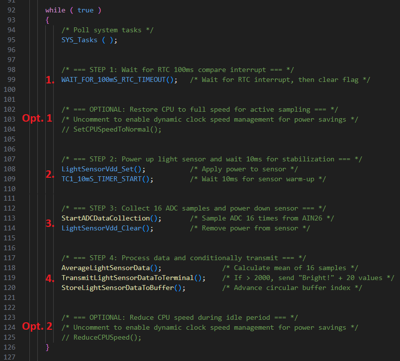
- Build the application and program the board
  - Set up the hardware connections for the AMBIENT Click Board (MIKROE-1890):
    - Use a jumper wire to connect PA22 (LightSensorVdd) from the PIC32CM PL10 CNano to the 3.3V Input pin on the AMBIENT Click Board on the breadboard
    - Use a second jumper wire to connect the ground pin from the Curiosity Nano Explorer to the GND pin on the AMBIENT Click Board
    - Use a third jumper wire to connect the AN (analog output) pin on the AMBIENT Click Board to PA26 (ADC0 AIN26) on the PIC32CM PL10 CNano
  - Connect the PIC32CM PL10 Curiosity Nano to the PC via USB cable. Also connect the Curiosity Nano Explorer board to the PC via USB cable.

      
  - Use the Command Palette to build the project by entering `MPLAB Clean Build`

      
  - Once the build completes, use the Command Palette again and enter `MPLAB Program Device` to program the PIC32CM PL10 CNano

    

**Note:** Ensure all jumper wire connections are secure and properly connected as described above. The AMBIENT Click Board is mounted on a breadboard, not inserted into mikroBUS headers.

**Note:** If the device is not detected by VS Code, close and relaunch VS Code, then try programming again.

## Part 3 Lab 2
- Set up MPLAB Data Visualizer
  - Click the MPLAB Data Visualizer icon (DV) in the toolbar

      
- When both the Curiosity Nano Explorer Board and the PIC32CM PL10 CNano are connected, the Data Visualizer will show all of the available data sources
- Under `Connections > CNano Explorer`, toggle the slider to connect to the device
- Once connected, click the graph icon to display raw data on the time plot. This will enable all the Power Monitor channels and they can be seen in the Data Axis panel.
- For this example, the current draw of the PIC32CM PL10 CNano on Ch1 and Ch4 will be monitored. As seen below, the Data Visualizer shows that the maximum current for Ch1 is around 2 mA, which corresponds with the Curiosity Nano Explorer User Guide. The Min, Max, and Average of the current on Ch4 can then be observed. The peaks of these pulses are from the AMBIENT Click Board being powered by the PIC32CM PL10 CNano.

  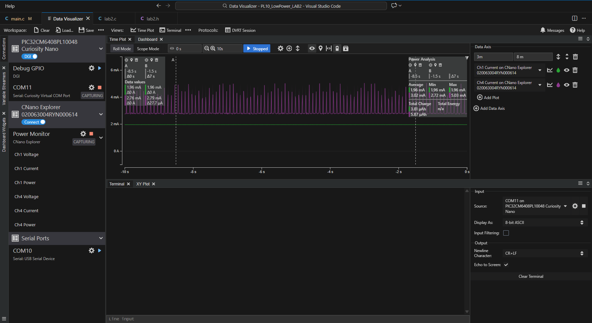

  - Set the time range to 10s. This helps to properly view the current waveform.

    

- **Note:** Use the Stopped and Running mode button to stop and run the time plot of power data as required

    

    
- Measure the Average Current and view light sensor data on the serial console
  - Open a serial console application like Tera Term or the serial COM port available in the Data Visualizer plug-in. Maintain the settings as follows:

    - Data bits: 8
    - Parity: None
    - Stop bits: 1
    - Flow Control: None
    - Baud rate: 230400

#### Once the AMBIENT Click Board senses that there is a bright environment, the terminal shows the message "Bright!" along with last 20 light samples:

  

  - Click the Freeze and place cursor icon to freeze the plot and automatically place two cursors, A and B. Move A and B horizontally as needed to cover a longer averaging interval.

  - Click the Power Analysis icon to display the power analysis values. The average current, along with timestamp and data values, are shown. This is the average current reading for the bright environment.

  - In the active-mode capture (no CPU scaling), the plot shows a higher average with regular current bursts from sensor power and ADC sampling. Example capture shows Ch1 averaging about 1.96 mA with a peak around 5.03 mA, reflecting the added workload relative to the Lab 1 baseline.

  

  - With dynamic CPU speed adjustments enabled, the average drops while the peaks stay similar. In this capture, Ch1 averages about 1.31 mA and Ch4 averages about 1.64 mA, with a peak around 5.1 mA. This shows the same sampling workload with lower idle power.

  

# Lab 3
### Purpose
After completing Lab 3, the following will be understood:

- How to configure the PIC32CM PL10 MCU to enter Standby mode when idle, reducing active mode power consumption
- How to use the ULPVREF (Ultra-Low-Power Voltage Reference) during Standby mode for improved efficiency
- How to use MPLAB® Data Visualizer to measure and analyze the standby mode currents of the PIC32CM PL10 MCU
- How to correlate code execution with current consumption waveforms to understand power optimization effectiveness

### Overview
This lab uses the PL10_LowPower_LAB3 MPLAB Harmony v3 project, configured with MPLAB Code Configurator (MCC), to demonstrate a light sensor application running in Standby mode. The application measures ambient light every 100 ms via the ADC. Sixteen samples are collected and averaged, and if the averaged value exceeds a threshold of 2000, the last 20 readings are transmitted to the terminal with the message "BRIGHT". The CPU remains in Standby mode when idle, minimizing power consumption while still performing periodic measurements.

The key difference from Lab 2 is that the CPU sleeps between each phase of the sampling cycle. Expect lower average current with short, repeatable bursts that align with the sensor warm-up, ADC conversions, and conditional UART output. This makes it easier to correlate current spikes with specific code sections.


#### Figure 3: Block diagram

#### Power Optimization Strategy
1. **Standby Mode Dominance:** CPU enters Standby mode immediately after each measurement cycle, eliminating active mode overhead.
2. **ULPVREF During Standby:** Ultra-low-power voltage reference is enabled during Standby mode, reducing regulator quiescent current.
3. **Sensor Power Gating:** Light sensor is powered only during the 10 ms warm-up and ADC sampling window, then powered down to save energy.
4. **Minimal Peripheral Activity:** Only essential peripherals (RTC, TC1, ADC, UART) are active; interrupts are disabled and events are prioritized when possible.

### Hardware Setup
- Configure the Curiosity Nano Explorer board to measure the MCU currents as in Lab 1 and Lab 2
  - Make sure the board is not powered by USB. (Remove the USB cable.)
  - For this lab, make sure the J506 Header is removed and leave the 2 headers for J504

  

  - After setup, connect both the PIC32CM PL10 Curiosity Nano and the Curiosity Nano Explorer board to the computer via the USB cables

## Lab 3 Structure
- Part 1: Configure SUPC Peripheral for Standby Mode Light Sensor Project
- Part 2: Add Application Code and Build
- Part 3: Use the MPLAB Data Visualizer to Observe Current Measurements and Tabulate the Results

## Part 1: Configure SUPC Peripheral for Standby Mode
- Develop Lab 3 by extending Lab 2. The Lab 3 project can also be opened in VS Code and the MPLAB Harmony Code Configurator (MCC) launched.
- Close the MPLAB Data Visualizer before launching MCC

**Note:** The RTC, TC1, ADC, and SERCOM1 configurations from Lab 2 remain the same. Only the SUPC peripheral requires new configuration for Standby mode operation.

- Configure the SUPC (Supply Controller) Block for Ultra-Low-Power Operation:
  - As in Lab 2, **Standby mode operation** automatically switches from the LDO to the ULP regulator when running on the 32.768 kHz oscillator

    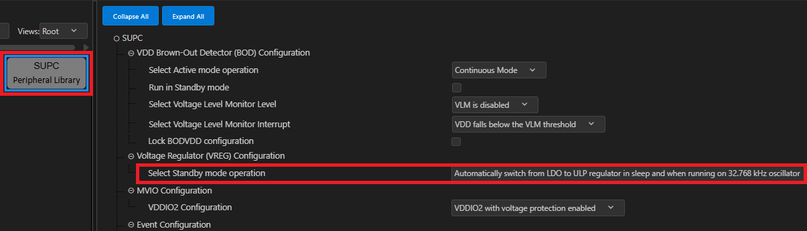

- Update TC1 for Standby Mode Operation:
  - Click on the TC1 module. The Configuration Options window will appear.
  - Ensure **One-Shot Mode** is enabled and the timeout is set to 10 ms (as configured in Lab 2)
  - Check the **Run during Standby** option to allow TC1 to operate while the CPU is in Standby mode
  - Check the **Clock On Demand** option to minimize clock tree overhead

    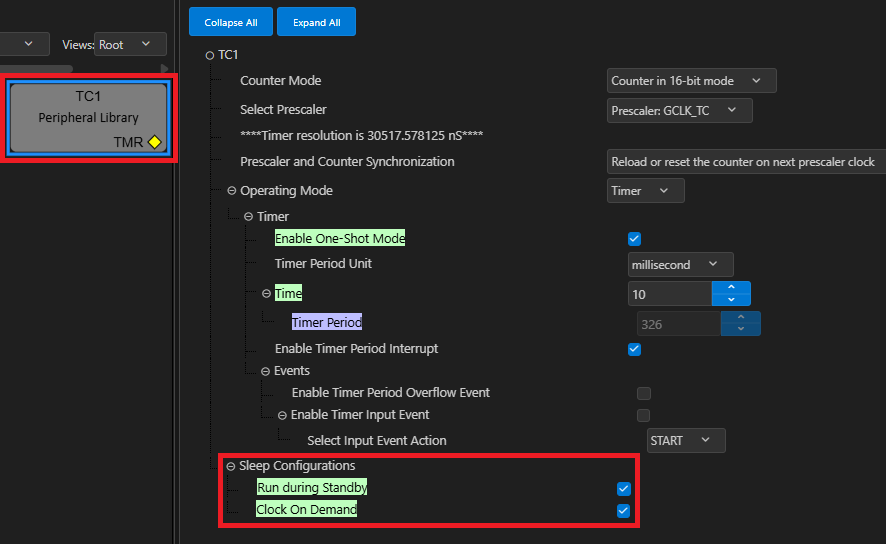

**Sleep Configuration Info:** Running TC1 during Standby allows the sensor warm-up timer to operate independently of the CPU, waking the core only when ADC sampling is needed.

- Configure the ADC0 module:
  - Click on the ADC0 module. The Configuration Options window will appear on the right.
  - The ADC0 module will be set as it was in Lab 2 with some changes
  - Check the **Run during Standby** option to allow ADC0 to operate while the CPU is in Standby mode
  - Check the **Clock On Demand** option to minimize clock tree overhead

    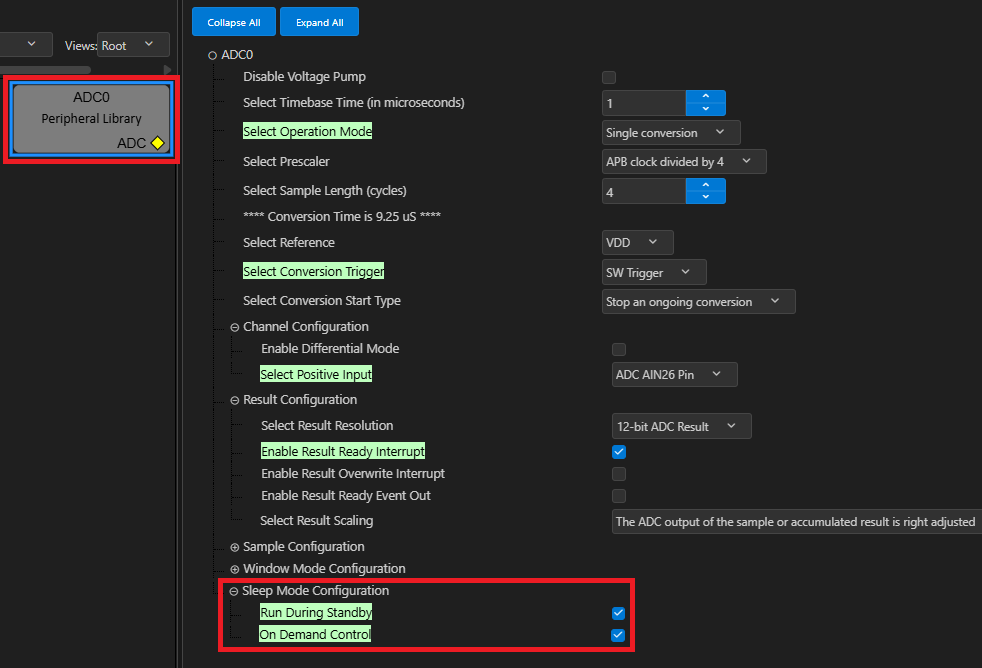

- Verify SERCOM1 Configuration for Higher Baud Rate:
  - Click on the SERCOM1 module
  - Ensure the **Baud Rate** is set to **230400 Hz** (230.4 kbps) to reduce data transmission time and minimize UART active mode overhead

    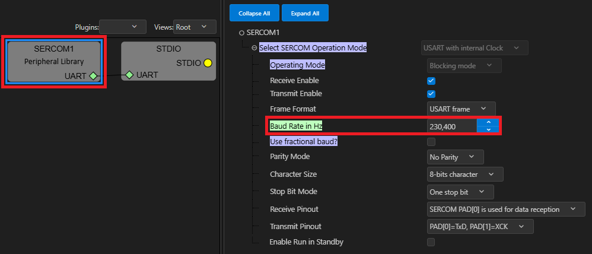

- Configure the main3.c file:
  - Select the System block in MCC
  - Navigate to **Device & Project Configuration > Project Configuration > Generate Main Source File**
  - Change the main file name to **main3**

    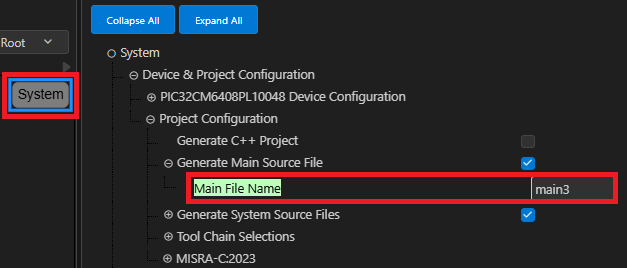

## Part 2: Add Application Code and Build
- Generate the code based on the peripheral configuration
  - Once all the above settings are made, click the **Generate** button on the MCC (Project Resource) tab to generate the code

    
  - The Output tab shows the status of the MPLAB Harmony code generation

    

- Add the lab3.c and lab3.h files
  - Remove the lab2.c and lab2.h files
  - Download the Lab 3 source files
  - Add the lab3.c and lab3.h files to the workspace under `My_MCC_Config > src` by drag and dropping the files either in VS Code or in the File Explorer
  - Remove the main.c file by right-clicking the file and navigating to Delete
  - Go to the main3.c file, rename the file to `main.c`, and include `lab3.h` after the `#include "definitions.h"` line

- Add the Initialization Application Code to `main3.c`
  Copy the APIs below directly to `main3.c` file after `SYS_Initialize ( NULL )`.

    ```
    /* 1. Pin Configuration - Light sensor starts powered off */
    LightSensorVdd_Clear();

    /* 2. Register interrupt callbacks for RTC (100ms timer), TC1 (10ms warm-up), and ADC (result ready) */
    RegisterCallbacks();

    /* 3. Enable ADC peripheral for light sensor measurements */
    ADC0_Enable();

    /* 4. Start RTC Timer and enable 100ms compare interrupt for sampling intervals */
    RTC_Timer32Start();
    RTC_Timer32InterruptEnable(RTC_TIMER32_INT_MASK_CMP0);

    /* 5. Disable UART initially to save power - will be enabled only when transmitting data */
    SERCOM1_USART_Disable();

    /* 6. Configure voltage regulator to remain active during standby mode (ultra-low-power mode) */
    WaitForULP();
    ```

  - **Step 1:** Pin Configuration - Light sensor starts powered off
  - **Step 2:** Register interrupt callbacks with the RTC timer (100 ms intervals), TC1 timer (10 ms sensor warm-up), and ADC (result ready)
  - **Step 3:** Enable the ADC peripheral for light sensor measurements
  - **Step 4:** Start the RTC Timer and enable 100 ms compare interrupt for periodic sampling intervals
  - **Step 5:** Disable UART initially to save power - will be enabled only when transmitting data
  - **Step 6:** Configure voltage regulator to remain active during standby mode (ultra-low-power mode)

    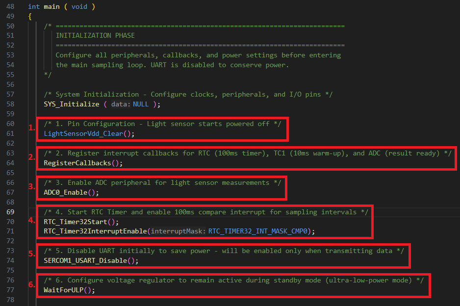

**Note:** SERCOM1 USART Transmitter is disabled to save power. It is enabled in the application code when light sensor values exceed the threshold and need to be transmitted to the serial console.

- Add the Main Task Application Code to the new `main.c`
  Copy the APIs below inside the `while(1)` loop after `SYS_Tasks()`.

    ```
    /* === STEP 1: Wait for RTC 100ms timeout ===
      * Enter standby sleep mode to conserve power. The RTC compare interrupt
      * will wake the MCU after 100ms. This is the deepest sleep state with
      * lowest power consumption while maintaining peripheral operation.
      */
    PM_StandbyModeEnter();                  /* Enter standby until RTC fires */
    WAIT_FOR_100mS_RTC_TIMEOUT();           /* Wait for RTC interrupt, then clear flag */

    /* === STEP 2: Activate light sensor and begin warm-up ===
      * Power on the light sensor and start the TC1 timer for a 10ms warm-up
      * delay. The sensor requires stabilization time before ADC sampling
      * produces accurate readings.
      */
    LightSensorVdd_Set();                   /* Apply power to light sensor */
    timer10msOccured = false;
    TC1_TimerStart();                       /* Start 10ms sensor warm-up timer */

    /* === STEP 3: Wait for 10ms sensor warm-up period ===
      * Enter standby mode during sensor stabilization to save power.
      * TC1 overflow interrupt will wake the MCU when the sensor is ready.
      */
    PM_StandbyModeEnter();                  /* Standby during sensor warm-up */
    while (!timer10msOccured) { }           /* Wait for TC1 10ms timeout */

    /* === STEP 4: Collect ADC samples from light sensor ===
      * Perform 16 consecutive ADC conversions on the light sensor input.
      * Multiple samples are collected to reduce noise through averaging.
      * After sampling completes, power down the sensor immediately to
      * minimize power consumption.
      */
    StartADCDataCollection();               /* Collect 16 ADC samples */
    LightSensorVdd_Clear();                 /* Power down sensor to save power */

    /* === STEP 5: Process and transmit data ===
      * Calculate the average of the 16 raw samples, store the result in the
      * circular buffer, and conditionally transmit all 20 buffered values
      * over UART if the current reading exceeds the brightness threshold.
      */
    AverageLightSensorData();               /* Average 16 samples into single value */
    TransmitLightSensorDataToTerminal();    /* Send "Bright!" + 20 samples if > threshold */
    StoreLightSensorDataToBuffer();         /* Store averaged value in circular buffer */

    /* === STEP 6: Prepare for next cycle ===
      * Ensure UART is disabled before returning to standby mode. The system is
      * now ready to enter sleep and wait for the next RTC timeout.
      */
    SERCOM1_USART_Disable();                /* Disable UART - ready for standby */
    ```

  - **Step 1:** Call `PM_StandbyModeEnter()` to place the CPU in Standby mode. The RTC compare interrupt will wake it after 100 ms.
  - **Step 2:** Once the RTC timeout occurs, power up the light sensor by calling `LightSensorVdd_Set()` (sets PA22 HIGH). Start the 10 ms one-shot timer by calling `TC1_TimerStart()` for sensor warm-up and stabilization.
  - **Step 3:** Return to Standby mode by calling `PM_StandbyModeEnter()`. The TC1 timeout interrupt will wake the CPU after 10 ms.
  - **Step 4:** Once TC1 times out, collect 16 ADC samples from AIN26 (PA26) by calling `StartADCDataCollection()`
  - **Step 5:** Power down the light sensor by calling `LightSensorVdd_Clear()` (sets PA22 LOW), calculate the mean of the 16 samples with `AverageLightSensorData()`, transmit when above the threshold with `TransmitLightSensorDataToTerminal()`, and store the result with `StoreLightSensorDataToBuffer()`
  - **Step 6:** Disable UART by calling `SERCOM1_USART_Disable()` before returning to Standby mode

    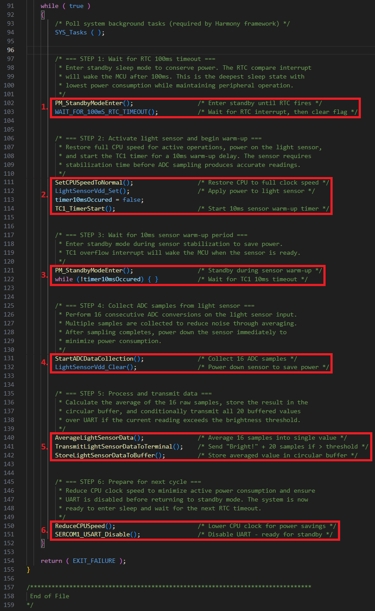

- Build the application and program the board
  - Set up the hardware connections for the AMBIENT Click Board (MIKROE-1890):
    - Use a jumper wire to connect PA22 (LightSensorVdd) from the PIC32CM PL10 CNano to the 3.3V Input pin on the AMBIENT Click Board on the breadboard
    - Use a second jumper wire to connect the ground pin from the Curiosity Nano Explorer to the GND pin on the AMBIENT Click Board
    - Use a third jumper wire to connect the AN (analog output) pin on the AMBIENT Click Board to PA26 (ADC0 AIN26) on the PIC32CM PL10 CNano
  - Connect the PIC32CM PL10 Curiosity Nano to the PC via USB cable. Also connect the Curiosity Nano Explorer board to the PC via USB cable.

      
  - Use the Command Palette to build the project by entering `MPLAB Clean Build`

      
  - Once the build completes, use the Command Palette again and enter `MPLAB Program Device` to program the PIC32CM PL10 CNano

    

**Note:** Ensure all jumper wire connections are secure and properly connected as described above. The AMBIENT Click Board is mounted on a breadboard, not inserted into mikroBUS headers.

**Note:** If either of the devices is not detected by VS Code, close and relaunch VS Code, then try programming again.

## Part 3: Use MPLAB Data Visualizer to Measure Average Current

- Set up MPLAB Data Visualizer
  - Click on the MPLAB Data Visualizer icon (DV) in the toolbar

      
- When both the Curiosity Nano Explorer Board and the PIC32CM PL10 CNano are connected, the Data Visualizer will show all of the available data sources
- Under `Connections > CNano Explorer`, toggle the slider to connect to the device
- Once connected, click the graph icon to display raw data on the time plot. This will enable all the Power Monitor channels and they can be seen in the Data Axis panel.
- For this example, the current draw of the PIC32CM PL10 CNano on Ch1 and Ch4 will be monitored. As seen below, the Data Visualizer shows that the maximum current for Ch1 is around 2 mA, which corresponds with the Curiosity Nano Explorer User Guide. The Min, Max, and Average of the current on Ch4 can then be observed. The peaks of these pulses are from the AMBIENT Click Board being powered by the PIC32CM PL10 CNano.

  - Set the time range to 10s. This helps to properly view the current waveform.

    

  - **Note:** Use the Stopped and Running mode button to stop and run the time plot of power data as required

    

    
- Measure the Average Current and view light sensor data on the serial console
  - Open a serial console application like Tera Term or the serial COM port available in the Data Visualizer plug-in. Maintain the settings as follows:

    - Data bits: 8
    - Parity: None
    - Stop bits: 1
    - Flow Control: None
    - Baud rate: 230400

#### When the AMBIENT Click Board senses a bright environment, the terminal shows the message "Bright!" along with the last 20 light samples. When the light sensor is in a dark environment, no data is displayed on the terminal:

  

  - Click the **Freeze and place cursor**  icon to freeze the plot and automatically place two cursors, A and B. Move A and B horizontally as needed to cover a larger averaging interval.

  - Click the **Power Analysis**  icon to display the power analysis values. The average current, along with timestamp and data values, are shown. This is the average current reading for the bright environment.

  - In the Lab 3 standby capture, the average current is lower than Lab 2 and the bursts are shorter, aligning with the standby sleep between phases. The plot shows Ch1 averaging about 895 uA (min about 694 uA, max about 1.96 mA) and Ch4 averaging about 1.06 mA with a peak around 3.52 mA. This confirms the reduced idle power while still showing brief sampling and transmit activity.

  

# Lab 4
## Purpose

After completing Lab 4, the following will be understood:
- How sleepwalking allows peripherals to run while the CPU remains in Standby
- How EVSYS coordinates RTC, timers, ADC, and DMA without CPU polling
- How DMA buffers measurements for burst transmission
- How to use MPLAB® Data Visualizer to capture sleepwalking current profiles
- How to correlate event-driven activity with current waveforms

## Overview
In this lab, the light sensor is sampled every 100 ms using event-triggered ADC conversions. Sixteen samples are accumulated and averaged in hardware, then DMA stores each averaged value into a circular buffer (20 entries). When the light level crosses the window threshold, TC2 generates an interrupt to wake the CPU so it can transmit the last 20 samples to the terminal. The CPU spends most of the time in Standby while the peripherals “sleepwalk.”

This lab moves the periodic sampling pipeline out of the CPU and into the event system, timers, ADC, and DMA. Compared to Labs 2 and 3, the CPU wakes only for threshold events, so the average current should be the lowest of the series while still showing short peaks during sensor power and UART transmission.

The application uses:
- RTC as the 100 ms time base (event generator)
- EVSYS to route events between peripherals
- TC0 to power the light sensor for ~10 ms per cycle
- TC1 to pace ADC conversions
- ADC for sampling and window monitoring
- DMA to store 20 samples in RAM without CPU intervention
- TC2 to wake the CPU when the threshold is crossed
- SERCOM1 USART (STDIO) for terminal output
- SUPC/PM for low-power Standby configuration


## Hardware Overview
- Configure the Curiosity Nano Explorer board to measure the MCU currents as in Lab 1 and Lab 2
  - Make sure the board is not powered by USB. (Remove the USB cable.)
  - For this lab, make sure the J506 Header is removed and leave the 2 headers for J504

  

  - After setup, connect both the PIC32CM PL10 Curiosity Nano and the Curiosity Nano Explorer board to the computer via the USB cables

This lab is divided into three parts:
- Part 1: Configure EVSYS + peripherals for sleepwalking
- Part 2: Add application code and build
- Part 3: Measure sleepwalking current in Data Visualizer

## Part 1: Configure EVSYS and Peripherals for Sleepwalking
- Develop Lab 4 by extending the Lab 3 project in VS Code
- Close MPLAB Data Visualizer before launching MCC

### Add peripherals
- In MCC, add TC0 and TC2 (TC1 already exists from Lab 3)
- EVSYS is available by default

### Configure clocks
The base clocks are already configured from Labs 2–3.
- Open Peripheral Clock Configuration and set:
  - TC0 -> GCLK1 = 32.768 kHz (uses the same low-power clock tree)
  - TC2 -> GCLK1 = 32.768 kHz
  - EVSYS 0/1/2 -> GCLK0 = 8 MHz

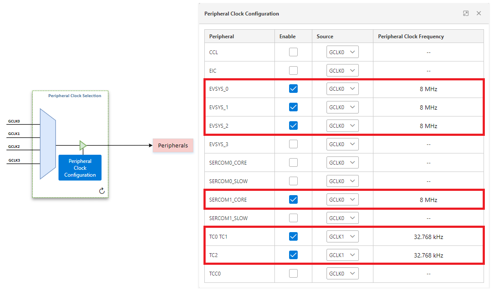

### Configure RTC (event-only)
1. Disable the RTC Interrupts section.
2. Disable Compare 0 Interrupt Enable (CPU no longer wakes on the compare match).
3. Keep the 100 ms Compare Value and enable Clear on compare Match.
4. Enable Compare 0 Event Output Enable (RTC compare now drives EVSYS instead of an ISR).

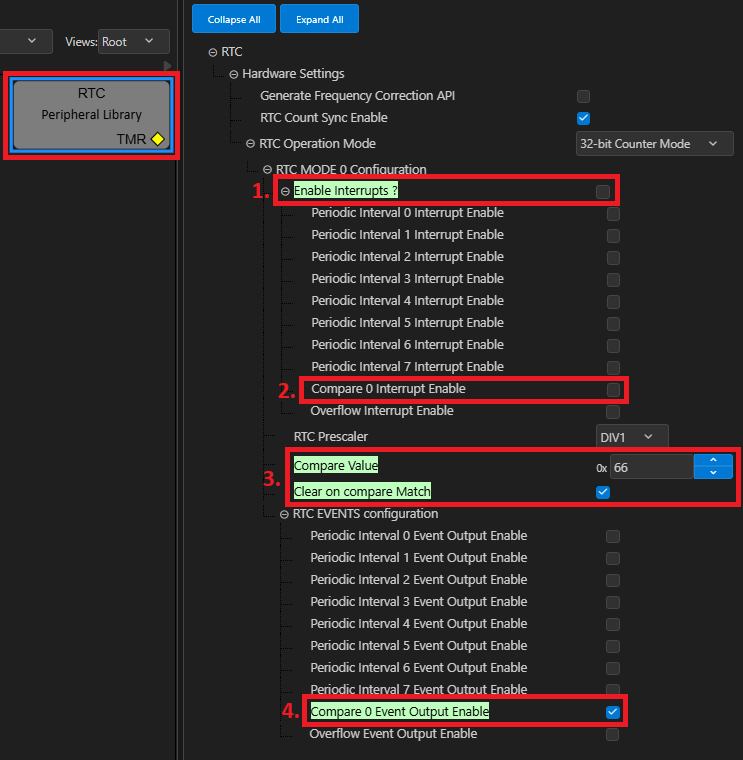

Optional Info:
- Disabling the interrupt prevents CPU wakeups; the event output still triggers an action without the CPU's intervention

### Configure TC0 (sensor power pulse)
1. Set Operating Mode to Compare.
2. Set Waveform Mode to Match PWM.
3. Set Compare 0 Value to 349 and Compare 1 Value to 348 (≈10.6 ms pulse).
4. Enable One-Shot Mode.
5. Enable Compare Input Event.
6. Set Input Event Action to RETRIGGER.
7. Enable Run during Standby and Clock on Demand.

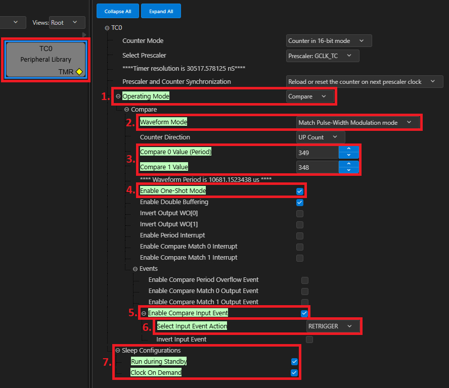

**Important Info:**
- TC0 PWM output on PA00 is used to power the light sensor only during sampling

### Configure TC1 (ADC pacing)
1. Disable Timer Period Interrupt.
2. Enable Timer Period Overflow Event and Timer Input Event, then set Input Event Action to RETRIGGER.
3. Enable Run during Standby and Clock on Demand.

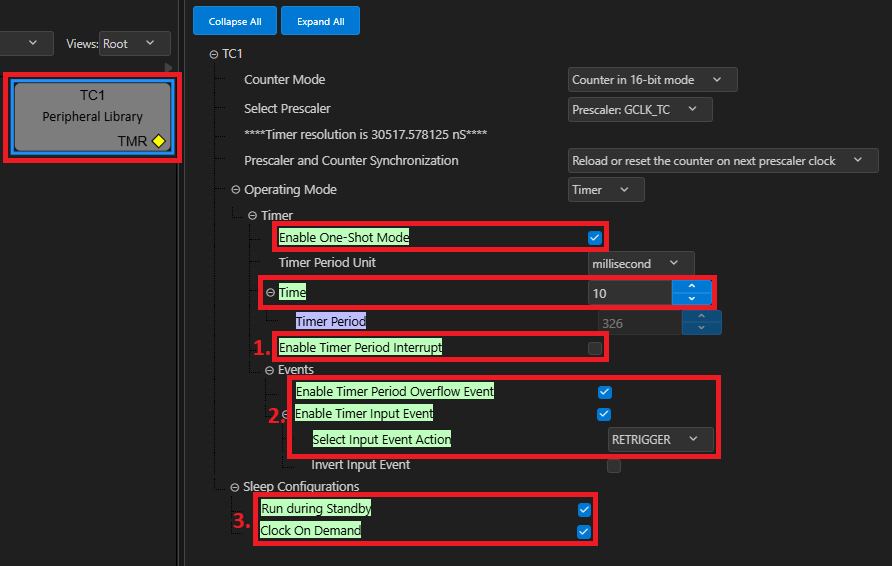

Optional Info:
- TC1 overflow event triggers ADC conversions without CPU involvement

### Configure TC2 (CPU wakeup)
1. Enable **One-Shot Mode** and set Time unit to microseconds with Time = 5 us.
2. Enable **Timer Period Interrupt**.
3. Enable **Timer Input Event** and set Input Event Action to RETRIGGER.
4. Enable **Run during Standby** and **Clock on Demand**.

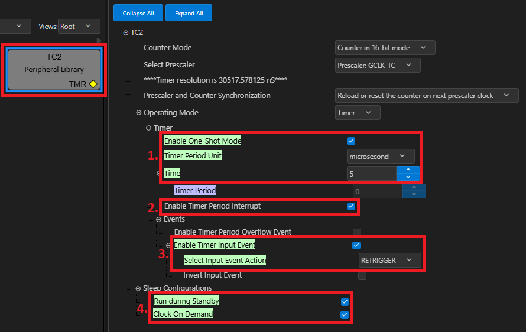

Optional Info:
- TC2 provides a short wakeup pulse after DMA stores the ADC result

### Configure ADC (event-triggered accumulation + window)
1. Set **Operation Mode** to Series with Accumulation (separate trigger per conversion).
2. Set **Conversion Trigger** to HW Event Trigger and **Start Event Input** to Enabled on Rising Edge.
3. Set **Conversion Start Type** to Start on ADC event input.
4. Enable **Result Ready Event Out** and set Result Scaling to Average/Right Adjust.
5. Set **Number of Accumulated Samples** to 16 (Right Shift by 4).
6. Set **Window Monitor Mode** to OUTPUT > WINHT, set Window Monitor Source to Use RESULT, and leave the Window Monitor Thresholds at the default value.
7. Enable **Window Comparator Interrupt** and Window Monitor Event Out.
8. Enable **Run During Standby** and **On Demand Control**.


Optional Info:
- ADC window monitor event triggers TC2 only when the threshold is crossed

### Configure SERCOM1 (UART)
- Set baud rate to 460800
- All other configurations remain the same

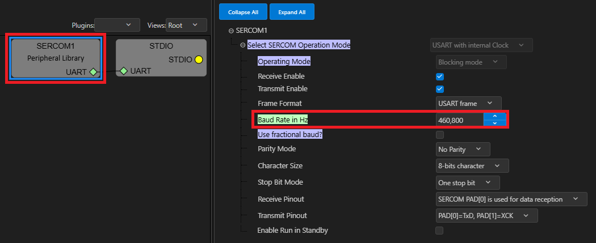

Optional Info:
- Higher baud rate minimizes time spent transmitting

### Configure SUPC and PM
- Keep SUPC and PM settings the same from Lab 3

### Configure EVSYS routing
- Open the **Event Configurator** inside the **Plugins** dropdown menu inside MCC to set the channels and events used for standby operation. This verifies Event Status and User Ready are working.
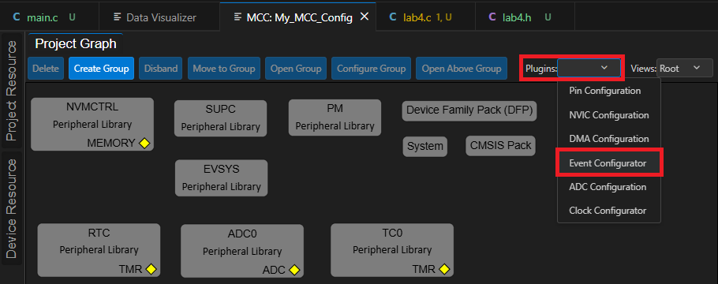

1. Add Channels:
  - Channel 0: RTC_CMP_0
  - Channel 1: TC1_OVF
  - Channel 2: ADC0_RESRDY

2. Add Event users:
  - TC0 EVU: CHANNEL_0
  - TC1 EVU: CHANNEL_0
  - TC2 EVU: CHANNEL_2
  - ADC0_START: CHANNEL_1

3.
- If any Event Status is red , check that the event output is enabled in the peripheral
- If any User Ready is red , verify the input event is enabled for that peripheral

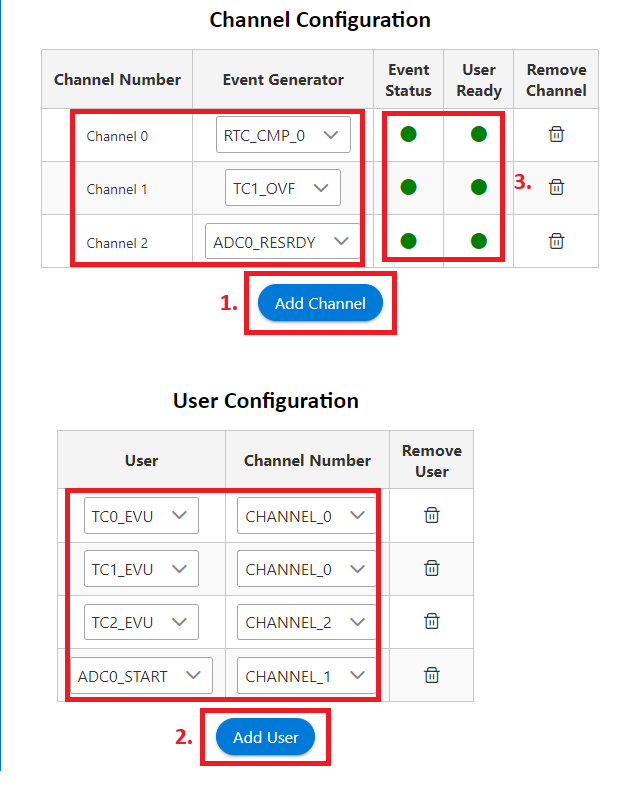

**Note:** For each channel, ensure Clock on Demand and Run in Standby are enabled for each peripheral (see each peripheral configuration above).

### Configure pins
- Open the Pin Settings tab
- In the Function column, set:
  - PB00 to SERCOM1_PAD0
  - PB01 to SERCOM1_PAD1
  - PA21 to TC2_WO1
  - PA26 to ADC0_AIN26
  - PA00 to TC0_WO0

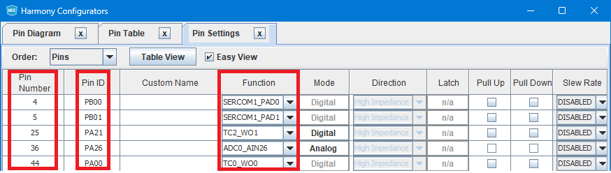

### Configure DMAC
- Open DMA Configuration plugin

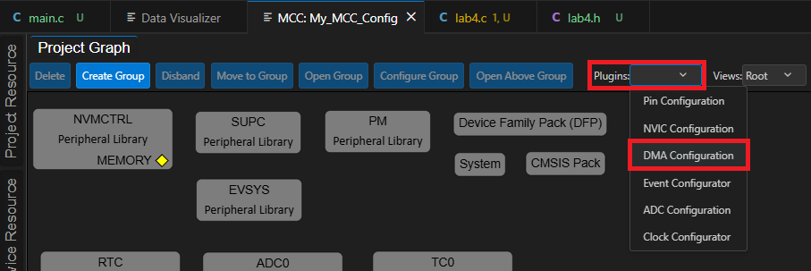

1. Add Channel 0:
  2. Trigger source: ADC0_RESRDY
  3. Use Linked List Mode: Enabled
  4. Trigger Action: One Beat Transfer per DMA Request
  5. Source Address Mode: Fixed Address Mode
  6. Destination Address Mode: Increment Address After Every Transfer
  7. Beat Size: 16-bit

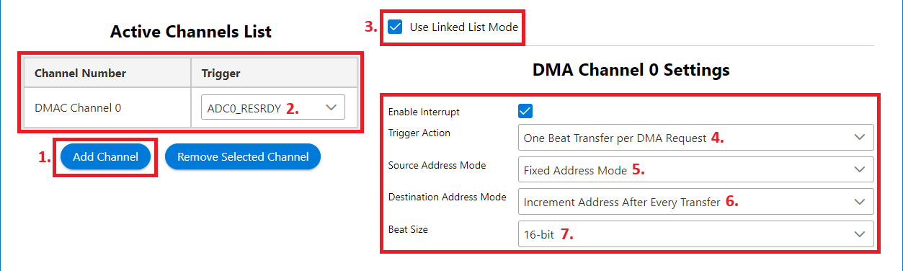

- In System > DMA (DMAC) > Use DMAC Channel 0, enable Run Channel in Standby

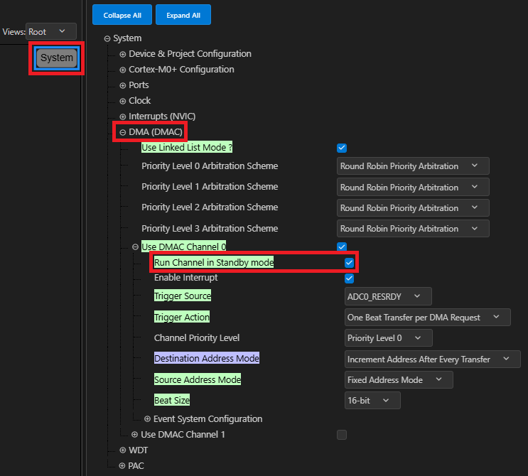

## Part 2: Add Application Code and Build
Generate the code with MCC.


### Add lab4 source files
- Remove lab3.c and lab3.h
- Add lab4.c and lab4.h into My_MCC_Config/src
- Rename main4.c to main.c and include lab4.h after definitions

Include this after `#include "definitions.h"` in main.c:
```#include "lab4.h"```

### Initialization code (after SYS_Initialize)

    /* 1. Disable DMA interrupts */
    DisableDMAInterrupts();

    /* 2. Set ADC channel descriptors */
    SetADCTransferDescriptors();

    /* 3. Enable timers */
    TC0_CompareStart();
    TC1_TimerStart();
    TC2_TimerStart();

    /* 4. Enable ADC and configure event start mode */
    ADC0_Enable();
    ADC0_ConversionStartModeSet(ADC_STARTMODE_EVENT);

    /* 5. Announce entry to sleep-walking mode, then disable UART */
    SERCOM1_USART_Enable();
    printf("\r\nEntering Sleep-Walking Mode\r\n");
    printf("RTC will trigger ADC via Event System\r\n");

    /* Disable SERCOM1 to save power until needed */
    SERCOM1_USART_Disable();

    /* 6. Start the RTC timer */
    RTC_Timer32Start();

    /* 7. Wait until ULPVREF is ready */
    WaitForULP();

    ReduceCPUSpeed();

Note: USART is disabled by default and only enabled when transmitting.

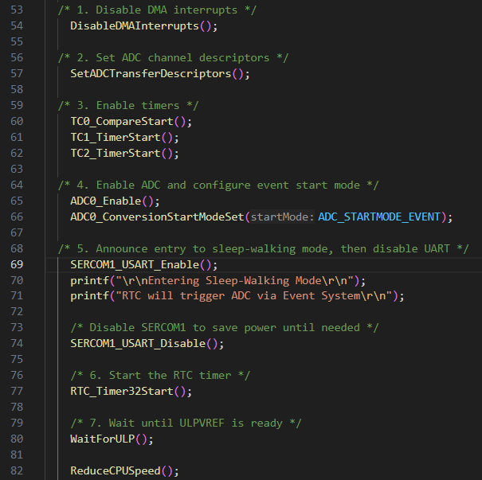

### Main loop (after SYS_Tasks)

    /* Enter standby mode - CPU will sleep until RTC wakes it up */
    PM_StandbyModeEnter();

    /* Suspend the DMA channel */
    SetCPUSpeedToNormal();
    DMAC_ChannelSuspend( DMAC_CHANNEL_0);

    /* Transmit the light sensor data to terminal */
    TransmitLightSensorDataToTerminal();

    /* Resume the DMA channel */
    DMAC_ChannelResume(DMAC_CHANNEL_0);

    ReduceCPUSpeed();

### Build and program

- Build the application and program the board
  - Set up the hardware connections for the AMBIENT Click Board (MIKROE-1890):
    - Use a jumper wire to connect PA22 (LightSensorVdd) from the PIC32CM PL10 CNano to the 3.3V Input pin on the AMBIENT Click Board on the breadboard
    - Use a second jumper wire to connect the ground pin from the Curiosity Nano Explorer to the GND pin on the AMBIENT Click Board
    - Use a third jumper wire to connect the AN (analog output) pin on the AMBIENT Click Board to PA26 (ADC0 AIN26) on the PIC32CM PL10 CNano
  - Connect the PIC32CM PL10 Curiosity Nano to the PC via USB cable. Also connect the Curiosity Nano Explorer board to the PC via USB cable.

      
  - Use the Command Palette to build the project by entering `MPLAB Clean Build`

      
  - Once the build completes, use the Command Palette again and enter `MPLAB Program Device` to program the PIC32CM PL10 CNano

    

**Note:** Ensure all jumper wire connections are secure and properly connected as described above. The AMBIENT Click Board is mounted on a breadboard, not inserted into mikroBUS headers.

**Note:** If either of the devices is not detected by VS Code, close and relaunch VS Code, then try programming again.
## Part 3: Measure Sleepwalking Current

- Set up MPLAB Data Visualizer
  - Click on the MPLAB Data Visualizer icon (DV) in the toolbar

      
- When both the Curiosity Nano Explorer Board and the PIC32CM PL10 CNano are connected, the Data Visualizer will show all of the available data sources
- Under `Connections > CNano Explorer`, toggle the slider to connect to the device
- Once connected, click the graph icon to display raw data on the time plot. This will enable all the Power Monitor channels and they can be seen in the Data Axis panel.
- For this example, the current draw of the PIC32CM PL10 CNano on Ch1 and Ch4 will be monitored. As seen below, the Data Visualizer shows that the maximum current for Ch1 is around 2 mA, which corresponds with the Curiosity Nano Explorer User Guide. The Min, Max, and Average of the current on Ch4 can then be observed. The peaks of these pulses are from the AMBIENT Click Board being powered by the PIC32CM PL10 CNano.

  - Set the time range to 10s. This helps to properly view the current waveform.

    

  - **Note:** Use the Stopped and Running mode button to stop and run the time plot of power data as required

    

    
- Measure the Average Current and view light sensor data on the serial console
  - Open a serial console application like Tera Term or the serial COM port available in the Data Visualizer plug-in. Maintain the settings as follows:

    - Data bits: 8
    - Parity: None
    - Stop bits: 1
    - Flow Control: None
    - Baud rate: 230400

#### When the AMBIENT Click Board senses a bright environment, the terminal shows the message "Bright!" along with the last 20 light samples. When the light sensor is in a dark environment, no data is displayed on the terminal:


### Power analysis
- Click the Freeze and place cursor icon. 

- Click the Power Analysis icon and read the average current for bright and dark cases. 

- Record the current for bright and dark environments

- In this Lab 4 capture, the Power Analysis shows an average of about 0.931 mA on Ch1 (min about 752 uA, max about 1.96 mA) and about 1.06 mA on Ch4 with a peak around 3.23 mA. Compared to the Lab 2 active-mode averages, the sleepwalking flow keeps the average draw lower while still showing short peaks during sensor power and UART bursts. It also stays at or below the Lab 3 standby averages, matching the expected trend as more work moves into peripherals and the CPU remains in standby.

  

In Lab 4, standby is even more effective than Lab 3 because the CPU is not part of the periodic sampling loop. The event system, timers, ADC, and DMA handle sampling and buffering while the core stays asleep, so the MCU can either remain in standby or wake briefly for unrelated work (for example, servicing another interrupt or a communication event) without disturbing the sampling schedule. When the light stays below the threshold, the window monitor never triggers TC2, so the CPU does not wake just to poll data; it wakes only when there is something meaningful to report, which keeps average power lower and preserves CPU bandwidth for other tasks.

## Summary
These code examples provide specific instructions to reduce system power consumption using sleep modes, performance levels, clock domains, the Event system, and sleepwalking peripherals. However, due to the limited time allotted to each lab, they do not provide all necessary background details on why each configuration item is required. Upon completion, additional resources (identified in the **Related Documentation** section at the top) are recommended for further study and to deepen understanding.

Now that all code examples are complete, the following objectives have been accomplished:
- Hands-on experience configuring and using system components and peripherals for low-power operations
- Hands-on experience using MPLAB Harmony code generated within an application
- Ability to measure and visualize power consumption using MPLAB Data Visualizer

