<!-- Please do not change this logo with link -->

<a target="_blank" href="https://www.microchip.com/" id="top-of-page">
   <picture>
      <source media="(prefers-color-scheme: light)" srcset="images/mchp_logo_light.png" width="350">
      <source media="(prefers-color-scheme: dark)" srcset="images/mchp_logo_dark.png" width="350">
      
   </picture>
</a>

# Low-Power Ambient Light Sensor Application Using the PIC32CM PL10 Curiosity Nano Board and Curiosity Nano Explorer — Developed with the MPLAB Tools for VS Code Extension

These code examples are intended to reinforce usage of the Arm® Cortex® in PIC32CM PL10 MCU low-power modes. These exercises are a guide in configuring peripherals for low power, understanding the code generated with MPLAB® Code Configurator (MCC), and using it in an application.

These examples provide specific instructions to reduce system power consumption using sleep modes, performance levels, clock domains, the Event system, and sleepwalking peripherals. Upon completion, readers are encouraged to use additional resources to deepen knowledge and understanding.

**<u>Upon completion, the following objectives will have been achieved:</u>**
- Have hands-on experience configuring and using system components and peripherals for low-power operations
- Have hands-on experience using the MPLAB Tools for VS Code Extension
- Have hands-on experience using MPLAB Harmony code generated within an application
- Be able to measure and visualize power consumption using Data Visualizer

## Related Documentation

- [PIC32CM6408PL10028/032/048/064 Data Sheet](https://ww1.microchip.com/downloads/aemDocuments/documents/MCU08/ProductDocuments/DataSheets/PIC32CM6408PL10-028-032-048-064-DataSheet-DS40002667.pdf)
- [MPLAB® XC32 C/C++ Compiler User's Guide for PIC32C/SAM MCUs](https://ww1.microchip.com/downloads/aemDocuments/documents/DEV/ProductDocuments/UserGuides/MPLAB-XC32-CC-Compiler-UG-for-PIC32CSAM-MCUs-DS50002895.pdf)
- [MPLAB® Harmony v3](https://www.microchip.com/en-us/tools-resources/configure/mplab-harmony)

## Software Used

- Visual Studio Code® v1.108.2 or newer
- MPLAB® Tools for VS Code® v1.2.2 or newer [(MPLAB® Tools for VS Code® 1.2.2)](https://www.microchip.com/en-us/tools-resources/develop/mplab-tools-vs-code)
- MPLAB® XC32 5.0.0 or newer compiler [(MPLAB® XC32 5.0.0)](https://www.microchip.com/en-us/tools-resources/develop/mplab-xc-compilers/xc32)

## Hardware Used

- [EV58G97A Curiosity Nano Explorer product page](https://www.microchip.com/en-us/development-tool/EV58G97A?_ga=2.255984587.1527562019.1718650260-1302344245.1675103399)
  - [User guide](https://ww1.microchip.com/downloads/aemDocuments/documents/MCU08/ProductDocuments/UserGuides/CNANO-Explorer-UserGuide-DS50003716.pdf)
  - [Schematics](https://ww1.microchip.com/downloads/aemDocuments/documents/MCU08/ProductDocuments/BoardDesignFiles/Curiosity-Nano-Explorer-Schematics.pdf)

- [EV10P22A PIC32CM PL10 Curiosity Nano Evaluation Kit product page](https://www.microchip.com/en-us/development-tool/ev10p22a#Overview)
  - [PIC32CM PL10 Curiosity Nano User Guide](https://ww1.microchip.com/downloads/aemDocuments/documents/MCU08/ProductDocuments/UserGuides/PIC32CM-PL10-UserGuide-DS50004003.pdf)
  - [Schematics](https://ww1.microchip.com/downloads/aemDocuments/documents/MCU08/ProductDocuments/BoardDesignFiles/PIC32CM-PL10-Curiosity-Nano-Schematics.pdf)

- [AMBIENT Click Board™ (MIKROE-1890)](https://www.mikroe.com/ambient-click)

---

# Standard VS Code Workflow

The following procedure applies to all labs in this repository. Unless otherwise stated, use this workflow to open, build, program, and measure each project.

## Open a Lab Project
1. Download and extract the repository.
2. Open Visual Studio Code®.
3. Select `File → Open Folder…`.
4. Choose the desired lab folder (for example, `PL10_LowPower_LAB1`).

The selected folder becomes the active workspace.

## Build the Project
1. Press `Ctrl + Shift + P` to open the Command Palette.
2. Select **MPLAB CMake: Clean Build**.

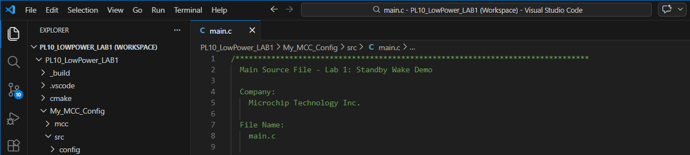

This generates the firmware output file in the `out` directory.

## Program the Device
1. Press `Ctrl + Shift + P`.
2. Enter **MPLAB: Program Device**.
3. Choose the generated `default.hex` file from the list.
4. Select **PIC32CM PL10 Curiosity Nano** as the debug tool.
5. Confirm the PIC32CM6408PL10048 device package is used.

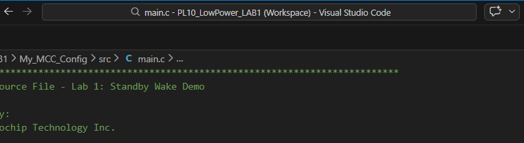

> **Note:** If the device is not detected by VS Code, close and relaunch VS Code, then try programming again.

## Open MPLAB Data Visualizer®
1. Press `Ctrl + Shift + P`.
2. Select **MPLAB: Data Visualizer**.

Use Data Visualizer to connect to the Curiosity Nano Explorer and monitor current measurements. 

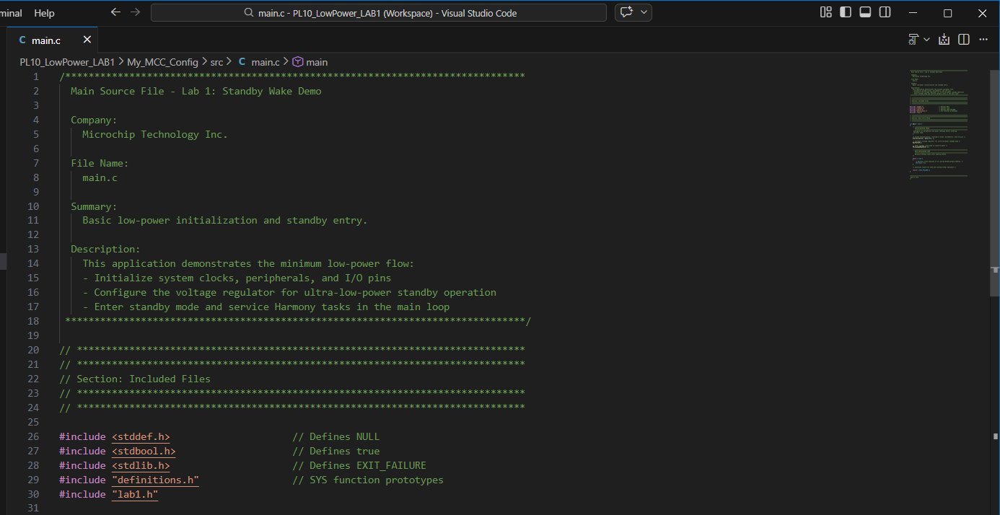

Measure Average Current
1. Click the **Toggle Inspect Values** icon to display the time and data values of cursors A and B.
2. Click the **Freeze and Place Cursor** icon to freeze the plot and position cursors A and B over the region of interest.
3. Click the **Power Analysis** icon to display average current and other derived values.

    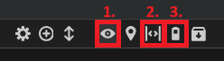

Review the average current in the Power Analysis table. For labs that use multiple channels, view both the Ch1 and Ch4 currents.

### Serial Console Configuration (Labs 2–4)

For labs that transmit data via UART, open a serial console application (such as Tera Term) or use the serial COM port available in the Data Visualizer plug-in. Use the following settings:

| Parameter | Value |
|-----------|-------|
| Data bits | 8 |
| Parity | None |
| Stop bits | 1 |
| Flow Control | None |
| Baud rate | 230400 (Labs 2–3) or 460800 (Lab 4) |

---

# Hardware Setup

> All labs share the same base hardware configuration. Lab-specific additions (such as the AMBIENT Click Board) are noted in the relevant lab section.

## Curiosity Nano Explorer Board Configuration

Use the Curiosity Nano Explorer board to measure the PIC32CM PL10 Curiosity Nano current through the onboard PAC1944 power monitor. Current measurement data is accessed on the PC through the Explorer board's MCP2221A USB-to-I²C bridge.

> **Important:** Ensure the board is **not** powered by USB when setting up jumpers and measurement configuration.

1. Remove the jumper on **J506** to enable CH1 (µA range). See Figure 1.
2. Leave the **J504** headers in place.
3. Set the I²C slide switch to **MCP2221A**. See Figure 2.

Only CH1 should be active during measurement. Selecting MCP2221A connects the PAC1944 power monitor to the USB interface, allowing MPLAB Data Visualizer to read current measurements from the board.

For additional information about the PAC1944 power monitor and measurement architecture, refer to the [Curiosity Nano Explorer Board User Guide](https://ww1.microchip.com/downloads/aemDocuments/documents/MCU08/ProductDocuments/UserGuides/CNANO-Explorer-UserGuide-DS50003716.pdf).

#### Figure 1: J506 Jumper Removal (CH1 Enable)
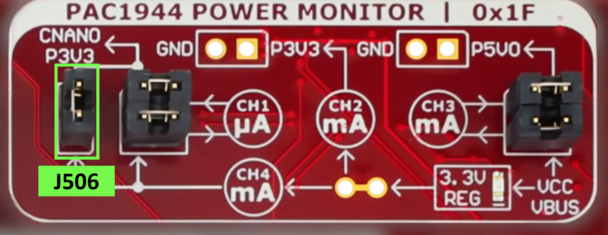

#### Figure 2: I²C Slide Switch Set to MCP2221A
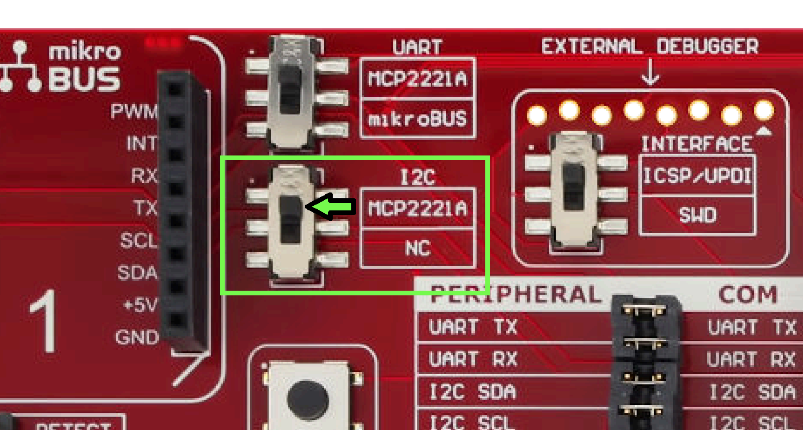

## Board Connection

1. Insert the PIC32CM PL10 Curiosity Nano into the CNano Adapter in the center of the Curiosity Nano Explorer board. Ensure the USB-C port faces the top side of the Curiosity Nano Explorer board.
2. Connect the PIC32CM PL10 Curiosity Nano to the PC via USB cable.
3. Connect the Curiosity Nano Explorer board to the PC via USB cable.

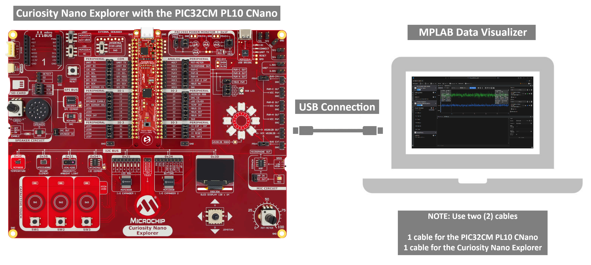

## AMBIENT Click Board Wiring (Labs 2–4)

Labs 2, 3, and 4 use the [AMBIENT Click Board™ (MIKROE-1890)](https://www.mikroe.com/ambient-click) mounted on a breadboard. Connect the board as follows:

- Connect a jumper wire from **PA22** (LightSensorVdd) on the PIC32CM PL10 CNano to the AMBIENT Click Board 3.3 V input pin.
- Connect a ground wire from the Curiosity Nano Explorer to the AMBIENT Click Board ground pin.
- Connect a jumper wire from the AMBIENT Click Board AN (analog output) pin to **PA26** (ADC0 AIN26) on the PIC32CM PL10 CNano.

> **Note:** PA22 is controlled in software using GPIO macros (`LightSensorVdd_Set()` / `LightSensorVdd_Clear()`) to power the sensor ON and OFF for each measurement cycle, further reducing power consumption.

> **Note:** Ensure all jumper wire connections are secure. The AMBIENT Click Board is mounted on a breadboard, not inserted into mikroBUS headers.

---

# Labs Overview

| Lab | Focus | Key Power Concept | Expected Ch1 Average | Expected Ch4 Average |
|-----|-------|--------------------|----------------------|----------------------|
| 1 | Baseline Standby Current | Isolate regulator and leakage current with no active peripherals | ~1.16 mA | ~1.15 mA |
| 2 | Active Mode Light Sensor | Periodic ADC sampling with UART reporting; optional CPU clock scaling | ~1.96 mA (no scaling) / ~1.31 mA (with scaling) | ~3.02 mA (no scaling) / ~1.64 mA (with scaling) |
| 3 | Standby Mode Light Sensor | Move sampling into Standby mode to reduce idle current | ~895 µA | ~1.06 mA |
| 4 | Sleepwalking Light Sensor | Event-driven peripheral operation without CPU wake-up | ~931 µA | ~1.06 mA |

---

# Lab 1 — Baseline Standby Current Measurement

## Purpose

After completing Lab 1, the following will be understood:

- How to use the Curiosity Nano Explorer board to measure the current and power consumption of the PIC32CM PL10 MCU in Standby mode
- How to use MPLAB® Data Visualizer to view and analyze the Standby mode currents of the PIC32CM PL10 MCU

## Overview

This lab uses the `PL10_LowPower_LAB1` MPLAB Harmony v3 project, configured with MPLAB Code Configurator (MCC), to measure the baseline current of the PIC32CM PL10 MCU in Standby mode. The MCU enters Standby mode immediately after startup, with no additional application functionality running.

This baseline capture is intentionally simple: it isolates regulator behavior, clock tree settings, and standby leakage. When reviewing the time plot, expect a steady, low-current trace with minimal activity, since no peripherals are actively sampling or transmitting.

### What Changes (Baseline)

This is the starting point. No peripherals are active beyond the default initialization. All subsequent labs are measured against this baseline.

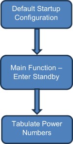

#### Figure 3: Lab 1 Block Diagram

## Application Flow

After `SYS_Initialize()`, the firmware executes two calls and halts:

1. **`WaitForULP()`** — Enables the ULP voltage regulator to stay on during Standby by setting the `SUPC_VREG_RUNSTDBY` bit, then waits (with timeout) for the write to latch.
2. **`PM_StandbyModeEnter()`** — Transitions the device into Standby, establishing the baseline low-power state.

No peripherals are started and no interrupts are enabled, so the MCU remains in Standby indefinitely.

## Expected Results

> ### Follow the Standard VS Code Workflow to build, program, and open Data Visualizer.
> 1. [Open](#open-a-lab-project) the Lab 1 Project
> 2. [Build](#build-the-project) the Lab 1 Project
> 3. [Program](#program-the-device) the Device
> 4. [Open](#open-mplab-data-visualizer) MPLAB Data Visualizer®

In the Lab 1 baseline capture, the trace should appear steady with minimal activity.
1. Click the **Toggle Inspect Values** icon .
2. Click the **Freeze and Place Cursor** icon  to freeze the plot and position cursors.
3. Click the **Power Analysis** icon  to display the power analysis values.

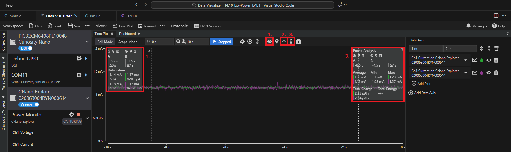

#### Figure 4: Lab 1 Power Analysis

Example measurements:
- **Ch1:** Average ~1.16 mA (min ~1.10 mA, max ~1.23 mA)
- **Ch4:** Average ~1.15 mA (min ~1.08 mA, max ~1.27 mA)

The flat, steady trace confirms the MCU is holding Standby with no peripheral activity. The ~1.16 mA baseline reflects the combined quiescent draw of the ULP voltage regulator, the 32.768 kHz oscillator, and leakage. Use these values as the reference point for comparing the added bursts and higher averages in Labs 2–4.

---

# Lab 2 — Active Mode Light Sensor and Average Current Measurements

## Purpose

After completing Lab 2, the following will be understood:

- How peripheral configuration and clock domain selection affect active-mode power consumption
- How dynamic frequency scaling reduces idle current without changing application behavior
- How to correlate current waveforms with sensor power, ADC sampling, and UART transmission phases

## Overview

This lab uses the `PL10_LowPower_LAB2` MPLAB Harmony v3 project to demonstrate periodic sampling of the [AMBIENT Click Board™ (MIKROE-1890)](https://www.mikroe.com/ambient-click) using the ADC. The application averages 16 ADC samples every 100 ms. If the average exceeds a threshold (1500), the last 20 averaged readings are printed to the terminal with the message "Bright!".

### What Changes from Lab 1

| Aspect | Lab 1 | Lab 2 |
|--------|-------|-------|
| MCU State | Standby (idle) | Active (running application loop) |
| Peripherals | None | RTC, TC1, ADC0, SERCOM1, SUPC, PM |
| Clock | Default | OSCHF ÷ 3 = 8 MHz (GCLK0); OSC32K = 32.768 kHz (GCLK1) |
| Sensor | None | AMBIENT Click Board sampled every 100 ms |
| UART | None | 230400 baud; threshold-triggered output |

In the time plot, expect repetitive current pulses from powering the sensor and running the ADC, with occasional UART bursts when the brightness threshold is exceeded.

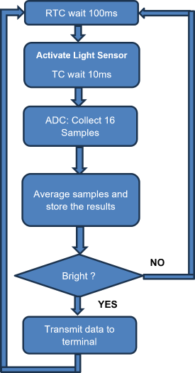

#### Figure 5: Lab 2 Block Diagram

## Peripheral Architecture

Lab 2 introduces two clock domains and six peripherals, each chosen to minimize power while supporting periodic sampling:

| Peripheral | Role | Power Rationale |
|------------|------|-----------------|
| **RTC** | 100 ms sampling trigger (Compare 0 interrupt, Clear on Match) | Clocked from OSC32K ÷ 32; runs at µW-level power |
| **TC1** | 10 ms one-shot sensor warm-up timer | Clocked from GCLK1 (32.768 kHz); fires once per cycle |
| **ADC0** | 16-sample software-triggered conversion on AIN26 (PA26) | Enabled only during the sampling window |
| **SERCOM1** | UART at 230400 baud via STDIO; TX on PB00, RX on PB01 | Disabled at startup; enabled only when transmitting |
| **SUPC** | Supply controller — auto-switch to ULP regulator in Standby | Default configuration; no changes required |
| **PM** | Power Manager — default configuration | No changes required |

The light sensor is powered through **PA22** (GPIO), toggled ON before sampling and OFF immediately after, so the sensor draws current only during the ~10 ms warm-up + ADC window.

> **Tip:** To examine the full peripheral configuration, open the Lab 2 project in MCC and inspect the Project Graph, Clock Configurator, and individual peripheral settings directly.

## Application Flow

Each 100 ms cycle follows this sequence:

1. **Wait** — `WAIT_FOR_100mS_RTC_TIMEOUT()` blocks until the RTC Compare 0 interrupt fires.
2. **Sensor power-up** — `LightSensorVdd_Set()` applies 3.3 V to the AMBIENT Click Board; TC1 runs a 10 ms one-shot for warm-up.
3. **ADC sampling** — 16 conversions are collected from AIN26 and averaged.
4. **Sensor power-down** — `LightSensorVdd_Clear()` removes power from the sensor.
5. **Conditional transmit** — If the average exceeds 1500, the UART is enabled, "Bright!" and the last 20 averaged values are printed, and the UART is disabled again.
6. **Buffer update** — The averaged reading is stored in a circular buffer (20 entries = 2 seconds of history).

### Dynamic Clock Scaling (Optional)

The application can optionally reduce the CPU frequency to 2.048 kHz (OSC32K ÷ 16 via GCLK0) during the idle period between sampling bursts, then restore it to 8 MHz (OSCHF ÷ 3) for active work. To enable this:

1. Uncomment both `SetCPUSpeedToNormal()` (top of the loop) and `ReduceCPUSpeed()` (bottom of the loop) in `main.c`.
2. Rebuild and reprogram the device.

This demonstrates that frequency scaling is one of the simplest and most effective optimizations — a single pair of function calls eliminates nearly half the average current without changing the sampling rate or data throughput.

## Expected Results

> ### Follow the Standard VS Code Workflow to build, program, and open Data Visualizer.
> 1. [Open](#open-a-lab-project) the Lab 2 Project
> 2. [Build](#build-the-project) the Lab 2 Project
> 3. [Program](#program-the-device) the Device
> 4. [Open](#open-mplab-data-visualizer) MPLAB Data Visualizer®

When the AMBIENT Click Board senses a bright environment, the terminal shows the message "Bright!" along with the last 20 light samples:

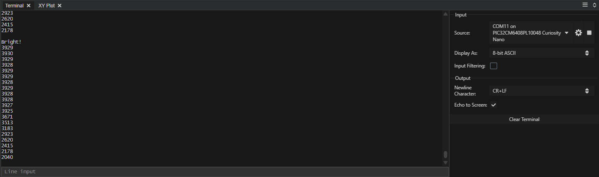

### Without CPU Scaling

1. Click **Toggle Inspect Values** 
2. Click **Freeze and Place Cursor**  to freeze the plot and position cursors.
3. Click **Power Analysis**  to display the power analysis values.

> **Note:** Ch1 (µA range) saturates near ~2 mA. When the active-mode average approaches or exceeds this limit, refer to the Ch4 output for accurate full-scale current readings.

In the active-mode capture (no CPU scaling), the plot shows a higher average with regular current bursts from powering the sensor, running the ADC, and periodic UART transmission.

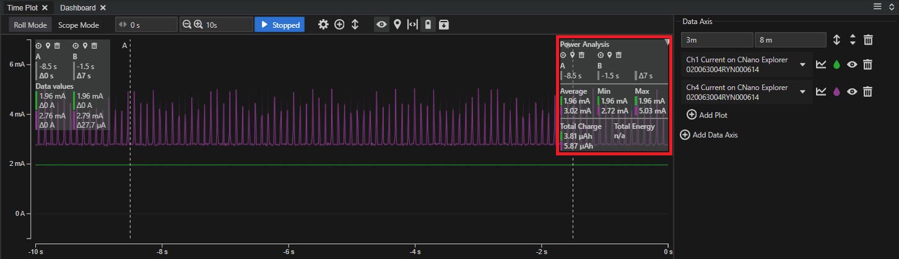

#### Figure 6: Lab 2 Power Analysis — No CPU Scaling

Example measurements:
- **Ch1:** Average ~1.96 mA (near µA-range saturation — values above ~2 mA clip on this channel)
- **Ch4:** Average ~3.02 mA, peak ~5.03 mA

The ~3.02 mA Ch4 average reflects the combined active-mode draw: CPU running at 8 MHz, 100 ms RTC-driven sample cycles (sensor power + 16 ADC conversions), and periodic UART bursts. Compared to the Lab 1 baseline (~1.16 mA), the active application adds roughly 1.86 mA of overhead on Ch4.

### With CPU Scaling

With dynamic CPU speed adjustments enabled (`ReduceCPUSpeed()` and `SetCPUSpeedToNormal()` uncommented), the average drops while the peaks stay similar.

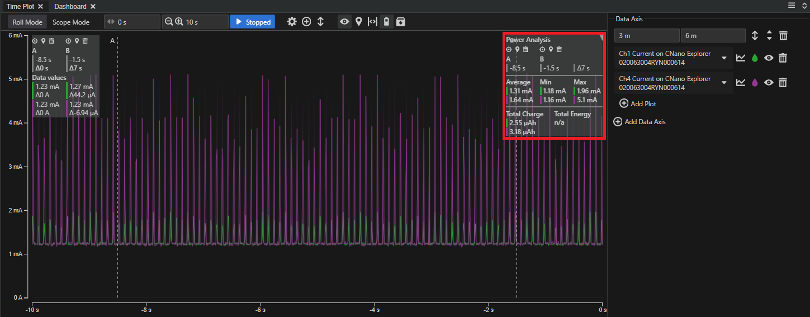

#### Figure 7: Lab 2 Power Analysis — With CPU Scaling

Example measurements:
- **Ch1:** Average ~1.31 mA (well within µA-range — idle current now below saturation)
- **Ch4:** Average ~1.64 mA, peak ~5.1 mA

With clock scaling enabled, the CPU drops to 2.048 kHz (OSC32K ÷ 16) between sampling bursts and returns to 8 MHz only for active work. The Ch4 average drops from ~3.02 mA to ~1.64 mA — a ~46% reduction — while the peaks remain similar (~5 mA), confirming that the sampling workload is unchanged and only idle-period current is reduced. The Ch1 average also falls below the µA-range saturation point, making Ch1 usable for monitoring in this configuration.

---

# Lab 3 — Standby Mode Light Sensor and Average Current Measurements

## Purpose

After completing Lab 3, the following will be understood:

- How entering Standby mode between measurement phases eliminates active-mode idle current
- How the ULP voltage reference (ULPVREF) reduces regulator quiescent draw during Standby
- How to configure TC1 and ADC0 to run during Standby so the CPU can sleep while peripherals remain operational
- How to correlate code execution with current consumption waveforms

## Overview

This lab uses the `PL10_LowPower_LAB3` MPLAB Harmony v3 project to demonstrate a light sensor application running in Standby mode. The application measures ambient light every 100 ms via the ADC. Sixteen samples are collected and averaged, and if the averaged value exceeds a threshold (2000), the last 20 readings are transmitted to the terminal with the message "Bright!". The CPU remains in Standby mode when idle, minimizing power consumption while still performing periodic measurements.

### What Changes from Lab 2

| Aspect | Lab 2 | Lab 3 |
|--------|-------|-------|
| Idle State | Active (CPU polling) | Standby (CPU sleeps between phases) |
| Sensor Warm-Up | CPU busy-waits 10 ms | CPU enters Standby; TC1 interrupt wakes it |
| RTC Wait | CPU busy-waits for flag | CPU enters Standby; RTC interrupt wakes it |
| VREG Config | Default | ULP regulator enabled via `WaitForULP()` |
| TC1 | Normal operation | Run during Standby + Clock On Demand enabled |
| ADC0 | Normal operation | Run during Standby + Clock On Demand enabled |
| Brightness Threshold | 1500 | 2000 |

The key insight: the CPU sleeps between each phase of the sampling cycle. Expect lower average current with short, repeatable bursts that align with the sensor warm-up, ADC conversions, and conditional UART output.

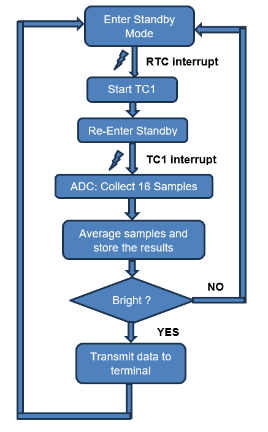

#### Figure 8: Lab 3 Block Diagram

## Power Architecture

Lab 3 uses the same peripherals and clock domains as Lab 2, with two critical configuration changes that enable Standby operation:

1. **TC1 and ADC0: Run during Standby + Clock On Demand** — These settings allow both peripherals to continue operating while the CPU is in Standby. The clock tree activates only when the peripheral needs it, minimizing overhead.
2. **SUPC: `WaitForULP()`** — The ULP voltage regulator is configured to stay on during Standby (`SUPC_VREG_RUNSTDBY`), reducing regulator quiescent current compared to the main LDO.

All other peripheral settings (RTC, SERCOM1, pin assignments) remain identical to Lab 2.

#### Power Optimization Strategy
1. **Standby Mode Dominance:** CPU enters Standby mode immediately after each measurement cycle, eliminating active mode overhead.
2. **ULPVREF During Standby:** Ultra-low-power voltage reference is enabled during Standby mode, reducing regulator quiescent current.
3. **Sensor Power Gating:** Light sensor is powered only during the 10 ms warm-up and ADC sampling window, then powered down.
4. **Minimal Peripheral Activity:** Only essential peripherals (RTC, TC1, ADC, UART) are active; CPU wakes only for specific interrupt events.

> **Tip:** To examine the Standby-specific configuration changes, open the Lab 3 project in MCC and compare the TC1 and ADC0 settings against Lab 2.

## Application Flow

The main loop follows the same logical sequence as Lab 2, but inserts `PM_StandbyModeEnter()` at two critical idle points:

1. **Standby → RTC wake** — The CPU enters Standby and sleeps until the RTC 100 ms compare interrupt fires.
2. **Sensor power-up + Standby → TC1 wake** — After powering the sensor, the CPU enters Standby again and sleeps during the 10 ms TC1 warm-up countdown.
3. **ADC sampling** — 16 conversions are collected (CPU is active for this burst).
4. **Sensor power-down → Conditional transmit → UART disable** — Data is processed, transmitted if above threshold, and the UART is disabled to prepare for the next Standby entry.

The critical difference from Lab 2: the CPU is active only during ADC sampling and data processing — it sleeps during both the 100 ms RTC wait and the 10 ms sensor warm-up period.

## Expected Results

> ### Follow the Standard VS Code Workflow to build, program, and open Data Visualizer.
> 1. [Open](#open-a-lab-project) the Lab 3 Project
> 2. [Build](#build-the-project) the Lab 3 Project
> 3. [Program](#program-the-device) the Device
> 4. [Open](#open-mplab-data-visualizer) MPLAB Data Visualizer®

When the AMBIENT Click Board senses a bright environment, the terminal shows "Bright!" along with the last 20 light samples. In a dark environment, no data is displayed.

1. Click **Toggle Inspect Values** 
2. Click **Freeze and Place Cursor**  to freeze the plot and position cursors.
3. Click **Power Analysis**  to display the power analysis values.

In the Lab 3 Standby capture, the average current is lower than Lab 2 and the bursts are shorter, aligning with the Standby sleep between phases.

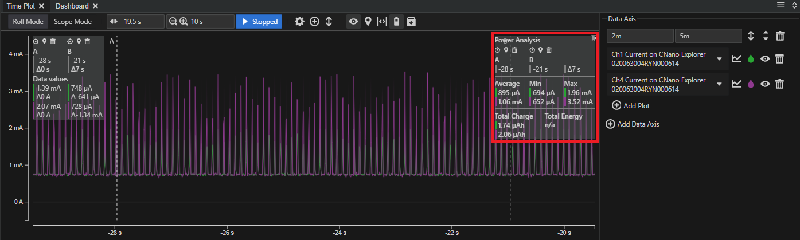

#### Figure 9: Lab 3 Power Analysis

Example measurements:
- **Ch1:** Average ~895 µA (min ~694 µA, max ~1.96 mA)
- **Ch4:** Average ~1.06 mA, peak ~3.52 mA

The Ch1 average of ~895 µA is a ~23% reduction from Lab 1's ~1.16 mA Standby baseline, despite running a full sampling application. This improvement comes from eliminating active-mode idle current: the CPU enters Standby between the RTC wait, sensor warm-up, and post-transmit phases, so the MCU draws near-baseline current for most of each 100 ms cycle. The brief peaks (~1.96 mA on Ch1, ~3.52 mA on Ch4) correspond to the sensor power-up, ADC burst, and conditional UART output.

---

# Lab 4 — Sleepwalking Light Sensor and Average Current Measurements

## Purpose

After completing Lab 4, the following will be understood:

- How sleepwalking allows peripherals to run autonomously while the CPU remains in Standby
- How EVSYS coordinates RTC, timers, ADC, and DMA without CPU intervention
- How DMA buffers measurements for burst transmission, eliminating per-sample CPU wakeups
- How event-driven architecture frees CPU bandwidth for other application tasks

## Overview

In this lab, the light sensor is sampled every 100 ms using event-triggered ADC conversions. Sixteen samples are accumulated and averaged in hardware, then DMA stores each averaged value into a circular buffer (20 entries). When the light level crosses the window threshold, TC2 generates an interrupt to wake the CPU so it can transmit the last 20 samples to the terminal. The CPU spends most of the time in Standby while the peripherals "sleepwalk."

### What Changes from Lab 3

| Aspect | Lab 3 | Lab 4 |
|--------|-------|-------|
| Sampling Trigger | RTC interrupt wakes CPU | RTC event triggers TC0/TC1 via EVSYS |
| ADC Trigger | Software (`ADC0_ConversionStart()`) | Hardware event from TC1 overflow |
| Data Storage | CPU reads ADC result | DMA transfers to circular buffer |
| CPU Wake Condition | Every 100 ms (RTC interrupt) | Only on ADC window threshold (TC2 interrupt) |
| New Peripherals | — | TC0, TC2, EVSYS, DMAC |
| UART Baud Rate | 230400 | 460800 |
| Sensor Power | GPIO macro (PA22) | TC0 PWM output (PA00) |

This lab moves the periodic sampling pipeline entirely out of the CPU and into the event system, timers, ADC, and DMA. The CPU wakes only for threshold events — not on every 100 ms cycle.

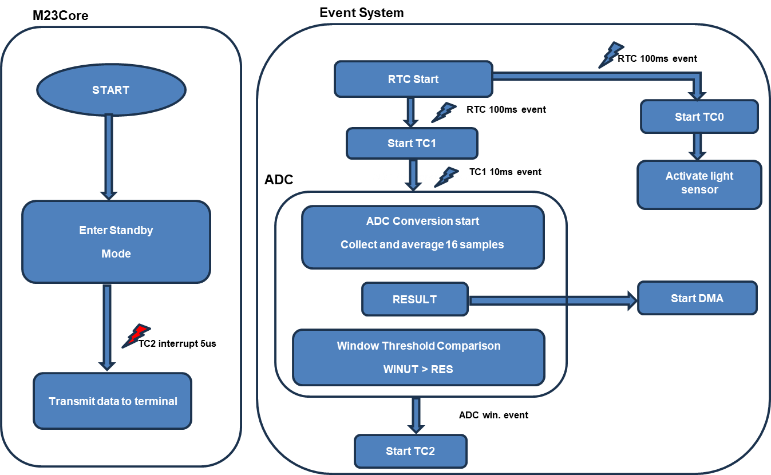

#### Figure 10: Lab 4 Block Diagram

## Peripheral Architecture

Lab 4 replaces CPU-driven sampling with a fully hardware-orchestrated event chain. Each peripheral has a specific role in the pipeline:

| Peripheral | Role | Power Rationale |
|------------|------|-----------------|
| **RTC** | 100 ms event generator (Compare 0 → EVSYS Ch0) | Interrupt disabled — drives events only, no CPU wake |
| **TC0** | ~10.6 ms PWM pulse on PA00 to power the sensor | One-shot, event-retriggered from EVSYS Ch0; runs in Standby |
| **TC1** | ADC pacing timer — overflow triggers ADC start | Event-retriggered from EVSYS Ch0; overflow → EVSYS Ch1 |
| **ADC0** | 16-sample hardware accumulation + window comparator | Event-triggered from EVSYS Ch1; result → EVSYS Ch2 + DMA |
| **DMA** | Transfers averaged ADC result to circular buffer in RAM | Linked-list descriptors; runs in Standby; no CPU involvement |
| **TC2** | CPU wakeup — 5 µs one-shot triggered by ADC window event | Only fires when threshold is crossed (EVSYS Ch2) |
| **SERCOM1** | UART at 460800 baud (higher baud = shorter transmit time) | Disabled except during threshold-triggered transmission |

### Event System Routing

| EVSYS Channel | Generator | Users | Purpose |
|---------------|-----------|-------|---------|
| Channel 0 | RTC_CMP_0 | TC0 EVU, TC1 EVU | Start sensor power pulse and ADC pacing timer |
| Channel 1 | TC1_OVF | ADC0_START | Trigger ADC conversion after sensor warm-up |
| Channel 2 | ADC0_RESRDY | TC2 EVU | Wake CPU only when window threshold is crossed |

> **Tip:** To examine the full event routing and peripheral configuration, open the Lab 4 project in MCC and inspect the Event Configurator plugin and individual peripheral settings.

## Application Flow

Unlike Labs 2–3, the main loop in Lab 4 is event-driven rather than sequential:

**Initialization:**
1. Configure DMA transfer descriptors (linked-list, ADC result register → circular buffer).
2. Start all timers (TC0, TC1, TC2) and enable ADC in event-triggered mode.
3. Print a startup message, then disable UART to save power.
4. Start RTC, configure ULP regulator (`WaitForULP()`), and reduce CPU speed.

**Main Loop (repeats indefinitely):**
1. **`PM_StandbyModeEnter()`** — CPU enters Standby. The entire sampling pipeline (RTC → EVSYS → TC0/TC1 → ADC → DMA) runs autonomously without CPU involvement.
2. **Threshold wake** — If the ADC window comparator detects a reading above the threshold, the event chain triggers TC2, which fires an interrupt to wake the CPU.
3. **Transmit** — CPU restores clock speed, suspends DMA for safe buffer access, transmits the last 20 averaged values, resumes DMA, and reduces clock speed.
4. **Return to Standby** — Loop restarts at step 1.

If the light stays below the threshold, the CPU never wakes — the peripherals continue sampling indefinitely while the core remains in Standby.

## Expected Results

> ### Follow the Standard VS Code Workflow to build, program, and open Data Visualizer.
> 1. [Open](#open-a-lab-project) the Lab 4 Project
> 2. [Build](#build-the-project) the Lab 4 Project
> 3. [Program](#program-the-device) the Device
> 4. [Open](#open-mplab-data-visualizer) MPLAB Data Visualizer®

When the AMBIENT Click Board senses a bright environment, the terminal shows the message "Bright!" along with the last 20 light samples. In a dark environment, no data is displayed.

1. Click **Toggle Inspect Values** 
2. Click **Freeze and Place Cursor**  to freeze the plot and position cursors.
3. Click **Power Analysis**  to display the power analysis values.

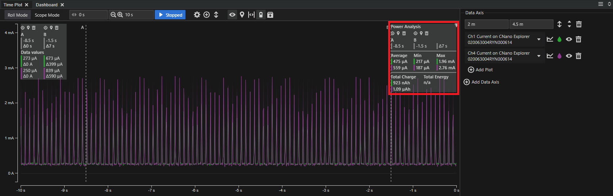

#### Figure 11: Lab 4 Power Analysis

Example measurements:
- **Ch1:** Average ~931 µA (min ~752 µA, max ~1.96 mA)
- **Ch4:** Average ~1.06 mA, peak ~3.23 mA

The Ch1 average of ~931 µA is comparable to Lab 3 (~895 µA), confirming that moving the sampling trigger, ADC pacing, and data storage entirely into the event system and DMA does not increase average consumption. The Ch4 average (~1.06 mA) matches Lab 3 as well, while the Ch4 peak drops from ~3.52 mA to ~3.23 mA because the CPU no longer executes ADC collection code on every cycle — it wakes only when the window comparator signals a threshold crossing. Compared to the Lab 1 baseline (~1.16 mA), the sleepwalking application achieves a lower average despite running a complete ambient-light monitoring pipeline, because the CPU is in Standby for the vast majority of each cycle.

### Why Lab 4 Is the Most Efficient

In Lab 4, Standby is even more effective than Lab 3 because the CPU is not part of the periodic sampling loop. The event system, timers, ADC, and DMA handle sampling and buffering while the core stays asleep, so the MCU can either remain in Standby or wake briefly for unrelated work (for example, servicing another interrupt or a communication event) without disturbing the sampling schedule. When the light stays below the threshold, the window monitor never triggers TC2, so the CPU does not wake just to poll data — it wakes only when there is something meaningful to report, which keeps average power lower and preserves CPU bandwidth for other tasks.

---

# Summary

These code examples provide specific instructions to reduce system power consumption using sleep modes, performance levels, clock domains, the Event system, and sleepwalking peripherals. However, due to the limited time allotted to each lab, they do not provide all necessary background details on why each configuration item is required. Upon completion, additional resources (identified in the [Related Documentation](#related-documentation) section) are recommended for further study and to deepen understanding.

| Lab | Technique | Ch1 Average | Ch4 Average | Ch4 vs Lab 2 (no scaling) |
|-----|-----------|-------------|-------------|---------------------------|
| 1 | Standby baseline (no peripherals) | ~1.16 mA | ~1.15 mA | — (baseline) |
| 2 | Active mode sampling (no CPU scaling) | ~1.96 mA | ~3.02 mA | — (reference) |
| 2 | Active mode sampling (with CPU scaling) | ~1.31 mA | ~1.64 mA | **−46%** |
| 3 | Standby mode sampling | ~895 µA | ~1.06 mA | **−65%** |
| 4 | Sleepwalking (event-driven) | ~931 µA | ~1.06 mA | **−65%** |

### What Each Lab Demonstrates

- **Lab 1 — Baseline:** Establishes the lowest achievable current with no application running. This is the floor set by the voltage regulator, oscillator, and silicon leakage. Every subsequent lab is measured against this reference.

- **Lab 2 (no CPU scaling) — Active Mode:** Adds a complete sensor-sampling and UART-reporting application. The ~3.02 mA Ch4 average shows the cost of keeping the CPU at 8 MHz full-time, even when it is idle between 100 ms sample intervals.

- **Lab 2 (with CPU scaling) — Dynamic Clock Scaling:** By dropping the CPU to 2.048 kHz during idle periods and restoring 8 MHz only for active work, the Ch4 average falls 46% (3.02 mA → 1.64 mA) with no change to sampling rate or data throughput. This demonstrates that frequency scaling is one of the simplest and most effective optimizations available — a single pair of function calls eliminates nearly half the average current.

- **Lab 3 — Standby Mode:** Replacing active idle time with `PM_StandbyModeEnter()` achieves a 65% reduction from the Lab 2 reference (3.02 mA → 1.06 mA on Ch4). The CPU wakes only for interrupt-driven events (RTC compare, TC1 timeout, ADC result ready), so the MCU spends the vast majority of each 100 ms cycle at near-baseline current. This is the recommended starting point for any battery-powered application that requires periodic sampling.

- **Lab 4 — Sleepwalking:** The event system, timers, ADC, and DMA handle the entire sampling pipeline autonomously — the CPU does not wake on every 100 ms cycle. It wakes only when the ADC window comparator detects a threshold crossing, which means:
  - **Power stays at 65% below the active-mode reference**, matching Lab 3 while performing the same work.
  - **CPU bandwidth is freed for other tasks.** Because the core is not involved in the periodic sample-average-store loop, it is available for communication stacks, sensor fusion, user-interface updates, or any other foreground work — all without disturbing the sampling schedule or increasing power consumption.
  - **Latency is deterministic.** The hardware event chain guarantees consistent 100 ms sample timing regardless of CPU load, eliminating jitter that software-driven loops can introduce.

  Sleepwalking is the most scalable architecture: adding more event-driven peripherals does not proportionally increase CPU wake time, so the power budget remains predictable as application complexity grows.

Now that all code examples are complete, the following objectives have been accomplished:
- Hands-on experience configuring and using system components and peripherals for low-power operations
- Hands-on experience using the MPLAB Tools for VS Code Extension
- Hands-on experience using MPLAB Harmony code generated within an application
- Ability to measure and visualize power consumption using MPLAB Data Visualizer